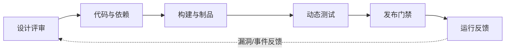

# 应用安全与 DevSecOps 平台

> AppSec 平台的核心不是“扫描更多”，而是让安全问题在设计、编码、依赖、构建、发布前被发现、排序、修复和验证。

## 能力边界

| 子能力 | 发现什么 | 典型位置 |
|---|---|---|
| Threat Modeling | 设计阶段风险 | 架构评审、PRD、ADR |
| SAST | 代码级缺陷 | IDE、PR、CI |
| SCA | 依赖漏洞和 license | PR、CI、SBOM |
| Secret Scanning | 泄露 token、key、证书 | Git、CI、制品库 |
| DAST / API Testing | 运行时 Web/API 漏洞 | 测试环境、预发 |
| IaC Scanning | Terraform/K8s/云配置风险 | PR、CI |
| Artifact Signing | 产物来源和完整性 | 构建、发布 |
| Release Gate | 高风险阻断 | CI/CD、变更流程 |

## 落地闭环

## 选型检查点

- 是否支持当前语言、框架、包管理器和 monorepo？
- 是否能在 PR 里给开发者可修复建议，而不是只生成 PDF？
- 是否支持风险排序：可达性、是否公网、是否敏感数据、是否在生产路径？
- 是否能接入 Jira/GitHub/GitLab、CI/CD、SBOM、制品库和 SIEM？
- 是否支持例外审批、到期、复审和审计证据？

## 关键指标

- 高危问题进入生产的数量
- PR 阶段发现率
- 修复 SLA 达成率
- 误报关闭率
- Secret 泄露平均修复时间
- 依赖升级滞后时间

## 典型陷阱

- 扫描工具很多，但开发者不知道怎么修。
- 所有高危都阻断，最后业务绕过门禁。
- 只看 CVSS，不看可达性、暴露面和业务影响。
- 只做 SCA 清单，不做依赖升级策略和例外治理。

## 官方资料入口

- [GitHub Advanced Security](https://docs.github.com/en/get-started/learning-about-github/about-github-advanced-security)
- [Semgrep Docs](https://semgrep.dev/docs/)
- [OWASP Dependency-Check](https://owasp.org/www-project-dependency-check/)
- [Snyk Docs](https://docs.snyk.io/)

## 关联

- [[../05-Topics/应用安全与 API 安全|应用安全与 API 安全]]
- [[../05-Topics/安全工程与 DevSecOps|安全工程与 DevSecOps]]
- [[../05-Topics/供应链安全|供应链安全]]
- [[../08-Playbooks/应用与 API 安全评审 Playbook|应用与 API 安全评审 Playbook]]
- [[../08-Playbooks/供应链安全评审 Playbook|供应链安全评审 Playbook]]

