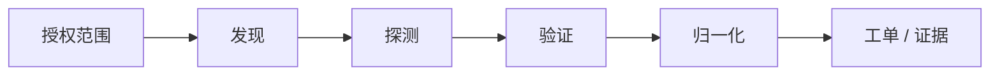

# CLI 工具链编排模式

## 模式说明

安全开源工具常以 CLI 形式存在。真正的能力不是运行单个命令，而是把多个 CLI 串成可重复、可限速、可记录、可复测的流程。

## 典型链路

## 代表组合

- 攻击面：subfinder / Amass -> httpx -> naabu -> nuclei。
- AppSec：ZAP / mitmproxy -> ffuf / kiterunner -> sqlmap / nuclei。
- DevSecOps：Semgrep -> Gitleaks -> Trivy -> Syft -> cosign。

## 风险

- 未限速会造成误伤。
- 未归一化会产生大量重复结果。
- 未接工单和 owner 会变成一次性扫描。

## 关联

- [[../01-Categories/攻击面发现与资产测绘|攻击面发现与资产测绘]]
- [[../03-Projects/Nuclei|Nuclei]]

