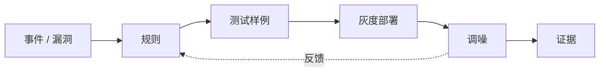

# 规则即代码检测模式

## 模式说明

把安全知识写成可版本化、可测试、可复用的规则，而不是只停留在手册、经验或一次性查询里。

## 代表工具

- Semgrep：代码模式规则。
- Nuclei：漏洞检测模板。
- Sigma：日志检测规则。
- YARA：恶意样本规则。
- OPA：策略即代码。
- Falco：运行时行为规则。

## 生命周期

## 关键判断

- 好规则必须有样例、解释、严重性、误报处理和 owner。
- 规则库应该随漏洞复盘和红蓝紫演练持续增长。

## 关联

- [[../03-Projects/Semgrep|Semgrep]]
- [[../03-Projects/Open Policy Agent|Open Policy Agent]]
- [[../03-Projects/Falco|Falco]]

