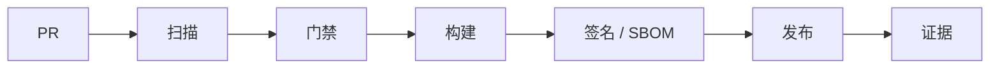

# 证据化 DevSecOps 模式

## 模式说明

DevSecOps 不只是扫描，而是把安全检查、修复、例外、签名、SBOM 和审计证据嵌入软件交付链。

## 主流程

## 代表组合

- Semgrep：代码安全。
- Gitleaks / TruffleHog：secret 泄露。
- Trivy / Grype / OSV-Scanner：漏洞。
- Syft：SBOM。
- cosign：签名。
- Scorecard：开源依赖健康度。

## 成熟度判断

- L1：能扫描。
- L2：能阻断高危。
- L3：能例外、复测和记录。
- L4：能生成审计证据。
- L5：能把事件复盘写回规则和门禁。

## 关联

- [[../01-Categories/DevSecOps 与供应链安全|DevSecOps 与供应链安全]]
- [[../03-Projects/Trivy|Trivy]]
- [[../03-Projects/Semgrep|Semgrep]]

