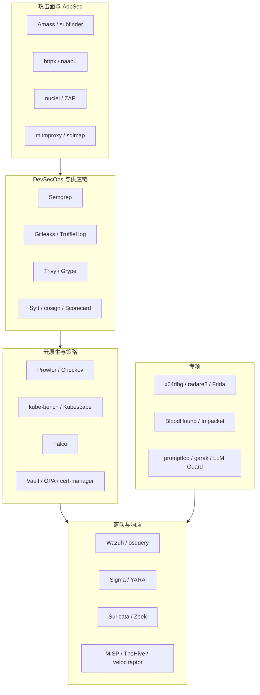

# 开源安全工具生态图

## 读图方式

- 左侧偏发现和验证，中间偏研发与云平台，右侧偏检测响应。
- 专项工具不要孤立学习，要回到检测、响应、加固和证据。

## 关联

- [[../01-Categories/分类索引|分类索引]]
- [[../03-Projects/项目索引|项目索引]]
- [[../09-Watchlist/重点 Watchlist|重点 Watchlist]]

