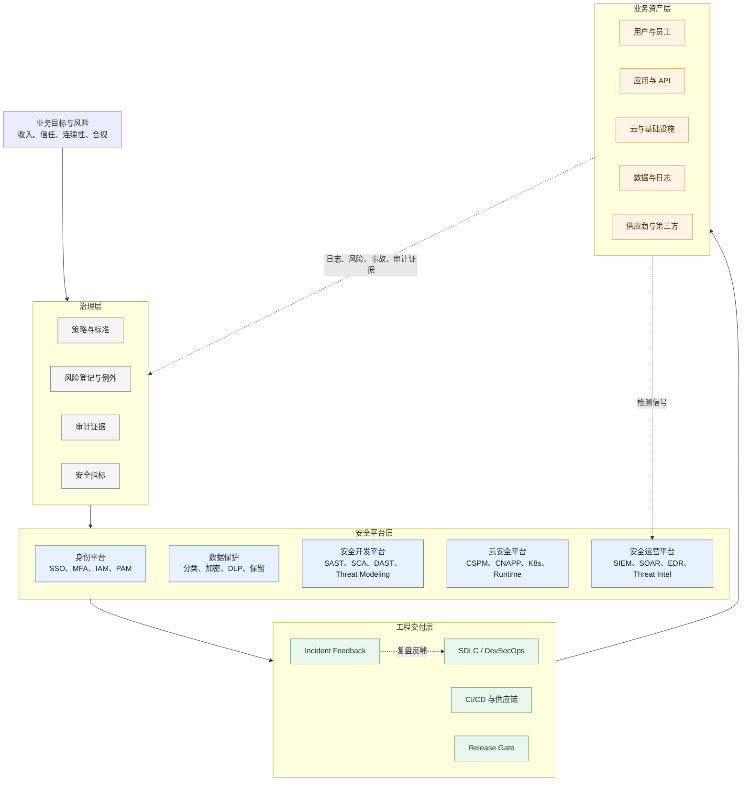

# 企业安全架构图

## 总图

## 怎么读

- `治理层` 定义责任、风险、控制和证据
- `安全平台层` 把控制做成可复用能力
- `工程交付层` 把安全嵌进设计、构建、发布和复盘
- `业务资产层` 是安全真正服务的对象

## 关联

- [[../05-Topics/企业安全架构|企业安全架构]]
- [[../05-Topics/安全治理、风险与合规|安全治理、风险与合规]]
- [[../05-Topics/安全工程与 DevSecOps|安全工程与 DevSecOps]]
- [[../05-Topics/安全指标与成熟度模型|安全指标与成熟度模型]]
