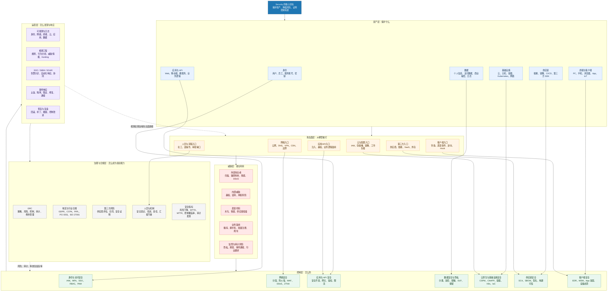

# 安全上帝视角全景架构图

> 这张图的目的不是覆盖所有术语，而是建立一个稳定的安全领域坐标：
> `资产 -> 攻击面 -> 威胁 -> 控制 -> 检测响应 -> 恢复 -> 治理合规`。

## 总图

## 怎么读这张图

### 第一层：资产

先问：我们保护什么？

- 身份和密钥
- 终端和客户端
- 应用和 API
- 数据
- 云和基础设施
- 软件供应链

如果资产不清楚，后面的安全控制都会变成堆工具。

### 第二层：攻击面

再问：攻击者从哪里进来？

- 网络入口
- 客户端入口
- 应用/API 入口
- 云配置入口
- 第三方入口
- 人员与流程入口

攻击面决定你优先学哪条分支。

### 第三层：控制

控制不是一个产品，而是一组设计：

- [[../05-Topics/身份与访问安全|身份与访问安全]]
- [[../05-Topics/网络安全|网络安全]]
- [[../05-Topics/客户端安全|客户端安全]]
- [[../05-Topics/应用安全与 API 安全|应用安全与 API 安全]]
- [[../05-Topics/数据安全与隐私保护|数据安全与隐私保护]]
- [[../05-Topics/云原生与基础设施安全|云原生与基础设施安全]]
- [[../05-Topics/供应链安全|供应链安全]]

### 第四层：运营

安全一定要能运行：

- 日志是否够
- 检测是否准
- 告警是否有人处理
- 事件是否能止血
- 复盘是否能改进控制

对应入口：[[../05-Topics/安全运营、检测与响应|安全运营、检测与响应]]

### 第五层：治理与合规

治理层回答：

- 谁负责
- 风险如何记录
- 控制如何证明
- 审计如何通过
- 地区合规如何持续更新

对应入口：

- [[../05-Topics/安全治理、风险与合规|安全治理、风险与合规]]
- [[../05-Topics/地区合规与监管坐标|地区合规与监管坐标]]

## 安全领域的三种学习入口

### 按攻击面学

适合工程师和安全工程候选人：

`网络 -> 客户端 -> 应用/API -> 云原生 -> 供应链`

### 按控制面学

适合架构师和平台负责人：

`身份 -> 数据 -> 应用安全 -> 运行时检测 -> 发布与变更治理`

### 按组织面学

适合安全负责人、GRC、技术管理者：

`风险 -> 控制 -> 证据 -> 审计 -> 事件响应 -> 地区合规`

## 与现有 vault 的连接

- AI 安全旁支：[[../../AI-Engineering/08-Maps/AI Security 控制点图|AI Security 控制点图]]
- 云原生安全旁支：[[../../Cloud-Native/03-Topics/云原生安全|云原生安全]]
- 支付合规旁支：[[../../International-Payments/05-Topics/支付合规实战框架|支付合规实战框架]]

## 下一步展开

1. 为每条主干补 `问题导航`
2. 为安全架构补 `决策导航`
3. 为企业安全补 `零信任 / SOC / DevSecOps / GRC` 四张专题图
4. 为地区合规补官方资料来源与更新节奏
