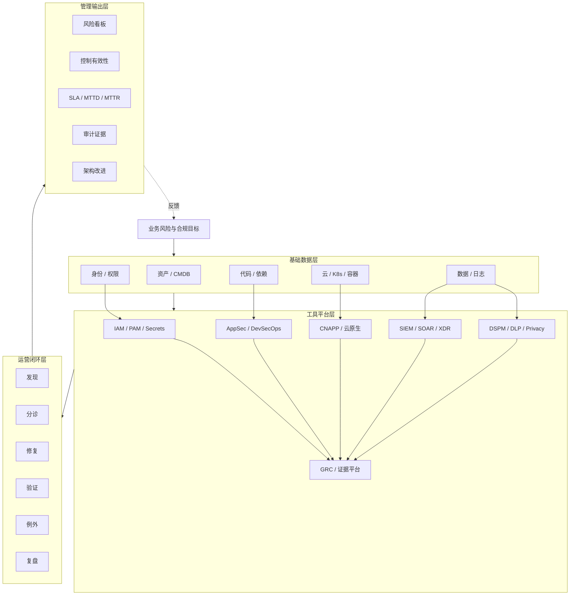

# 安全工具平台能力地图

> 图类型：capability-map。它适合回答“安全能力如何通过工具平台落到组织流程里”。

## 主图

## 读图方式

- 左右不是产品清单，而是能力落地链路：先有基础数据，再有平台，再有流程，最后才有指标和证据。
- 工具平台层必须互联：IAM、DevSecOps、CNAPP、SIEM、DLP、GRC 如果割裂，组织就只能靠人肉同步。
- GRC 不应该孤立在审计部门，它应该吃到身份、云、代码、检测、数据平台的自动证据。
- SIEM 不应该孤立在 SOC，它应该拿到资产、身份、云、应用、数据上下文。

## 决策视角

| 如果痛点是 | 优先平台 | 前置条件 | 交付物 |
|---|---|---|---|
| 账号滥用、高权限不可控 | IAM / PAM / Secrets | 账号源、角色、审批 | 权限矩阵、提权流程、审计日志 |
| 漏洞进生产、依赖风险 | AppSec / DevSecOps | 代码仓、CI/CD、owner | 扫描门禁、修复 SLA、例外记录 |
| 云配置和容器风险 | CNAPP | 云账号、标签、IaC | 云基线、攻击路径、修复工单 |
| 攻击看不见、响应慢 | SIEM / SOAR / XDR | 最小日志源、分诊流程 | 检测规则、case、响应 playbook |
| 敏感数据不可见 | DSPM / DLP / Privacy | 数据地图、分类规则 | 敏感数据清单、访问治理、隐私证据 |
| 审计证据靠手工 | GRC / IRM | 控制库、owner、证据源 | 控制映射、风险登记、自动证据 |

## 钻取地图建议

- 身份平台架构图：员工身份、机器身份、PAM、Secrets、审计。
- DevSecOps 流水线图：设计、代码、依赖、构建、发布、运行反馈。
- SOC 检测工程图：日志源、规则、告警、case、响应、复盘。
- GRC 证据流图：控制、系统、证据源、审计、整改。

## 关联

- [[../02-Tools/工具平台分类索引|工具平台分类索引]]
- [[../02-Tools/安全工具平台总览|安全工具平台总览]]
- [[../08-Playbooks/安全工具平台选型与落地 Playbook|安全工具平台选型与落地 Playbook]]
- [[./安全点线面能力地图|安全点线面能力地图]]

