# 安全点线面能力地图

> 这张图回答：如果想完整掌握安全，应该知道哪些“点”，串起哪些“线”，最终形成哪些“面”的能力。

## 总图

```mermaid
flowchart TB
  Goal["安全掌握目标<br/>知道该学什么，也知道能做什么"]

  subgraph Points["点：最小知识与控制颗粒"]
    Mind["安全思维<br/>资产、威胁、风险、控制"]
    Identity["身份与权限<br/>IAM、MFA、SSO、PAM、Secret"]
    Network["网络与边界<br/>分段、WAF、DDoS、DNS、ZTNA"]
    AppAPI["应用/API<br/>鉴权、授权、输入、业务逻辑"]
    Data["数据与隐私<br/>分类、加密、脱敏、保留删除"]
    Cloud["云与基础设施<br/>云 IAM、K8s、容器、IaC"]
    Supply["供应链<br/>SCA、SBOM、签名、CI/CD"]
    Endpoint["客户端与终端<br/>EDR、MDM、浏览器、App 加固"]
    Crypto["密码与密钥<br/>TLS、KMS、证书、轮换"]
    Vuln["漏洞与攻击面<br/>扫描、分级、修复、例外"]
    Logs["日志与检测<br/>SIEM、规则、行为、审计"]
    GRC["治理合规<br/>风险、控制、证据、审计"]
  end

  subgraph Lines["线：把点串成过程"]
    AttackLine["攻击链<br/>入口、提权、横移、外传"]
    SDLCLine["安全开发线<br/>设计、编码、测试、发布"]
    IRLine["事件响应线<br/>发现、止血、取证、恢复、复盘"]
    DataLine["数据生命周期<br/>收集、使用、共享、保留、删除"]
    IdentityLine["身份生命周期<br/>入职、授权、变更、回收"]
    CloudLine["云运行线<br/>配置、工作负载、网络、运行时"]
    SupplyLine["软件供应链线<br/>依赖、构建、产物、发布"]
    AuditLine["合规审计线<br/>要求、控制、证据、整改"]
  end

  subgraph Surfaces["面：组织级安全能力"]
    Architecture["企业安全架构<br/>统一边界、平台、默认控制"]
    SecOps["安全运营体系<br/>SOC、检测工程、响应协同"]
    DevSecOps["安全工程平台<br/>Release Gate、模板、自动化"]
    RiskGov["风险治理体系<br/>Risk Register、例外、指标"]
    PrivacyGov["数据与隐私治理<br/>数据地图、DPIA、跨境、通报"]
    BizSec["业务安全能力<br/>反滥用、反欺诈、关键流程保护"]
  end

  subgraph Outputs["输出：能做什么"]
    Diagnose["能诊断<br/>问题分级、影响判断"]
    Design["能设计<br/>控制组合、架构方案"]
    Review["能评审<br/>上线、API、数据、第三方"]
    Respond["能响应<br/>事件处置、恢复、复盘"]
    Prove["能证明<br/>审计证据、指标、报告"]
    Teach["能讲清楚<br/>面试、汇报、培训、复盘"]
  end

  Goal --> Points
  Points --> Lines
  Lines --> Surfaces
  Surfaces --> Outputs

  Mind --> AttackLine
  Identity --> IdentityLine
  AppAPI --> SDLCLine
  Data --> DataLine
  Cloud --> CloudLine
  Supply --> SupplyLine
  Logs --> IRLine
  GRC --> AuditLine

  AttackLine --> SecOps
  SDLCLine --> DevSecOps
  IRLine --> SecOps
  DataLine --> PrivacyGov
  IdentityLine --> Architecture
  CloudLine --> Architecture
  SupplyLine --> DevSecOps
  AuditLine --> RiskGov

  Architecture --> Design
  SecOps --> Respond
  DevSecOps --> Review
  RiskGov --> Prove
  PrivacyGov --> Prove
  BizSec --> Diagnose

  classDef goal fill:#1f77b4,color:#fff,stroke:#0d3d66;
  classDef point fill:#e8f2ff,stroke:#6aa3d8,color:#17324d;
  classDef line fill:#fff4e6,stroke:#f0a44b,color:#4d2b00;
  classDef surface fill:#e9f7ef,stroke:#62a878,color:#123d20;
  classDef output fill:#f0e9ff,stroke:#8b6fd6,color:#24164d;

  class Goal goal;
  class Mind,Identity,Network,AppAPI,Data,Cloud,Supply,Endpoint,Crypto,Vuln,Logs,GRC point;
  class AttackLine,SDLCLine,IRLine,DataLine,IdentityLine,CloudLine,SupplyLine,AuditLine line;
  class Architecture,SecOps,DevSecOps,RiskGov,PrivacyGov,BizSec surface;
  class Diagnose,Design,Review,Respond,Prove,Teach output;
```

## 点：应该知道什么

“点”是安全知识的最小颗粒。它们不一定直接解决问题，但缺了它们，判断会漂。

| 点 | 应该知道 | 能力标志 |
|---|---|---|
| 安全思维 | 资产、攻击面、威胁、风险、控制、证据 | 能把任何安全问题翻译成风险语言 |
| 身份与权限 | 认证、授权、最小权限、MFA、PAM、secret | 能判断谁能访问什么、凭什么访问 |
| 网络与边界 | 分段、边界、东西向流量、WAF、DDoS、DNS | 能看懂流量路径和隔离边界 |
| 应用/API | authn/authz、输入输出、业务逻辑、OWASP | 能评审系统上线和 API 风险 |
| 数据与隐私 | 分类分级、加密、脱敏、保留删除、跨境 | 能判断数据处理是否合法、可控、可审计 |
| 云与基础设施 | 云 IAM、CSPM、K8s、容器、IaC、运行时 | 能发现云配置和工作负载风险 |
| 供应链 | SCA、SBOM、签名、构建可信、第三方 | 能判断依赖、构建、发布是否可信 |
| 客户端与终端 | EDR、MDM、App 加固、浏览器、钓鱼 | 能理解用户设备为什么是入口 |
| 密码与密钥 | TLS、证书、KMS、HSM、轮换、密钥生命周期 | 能区分加密、签名、哈希、tokenization |
| 漏洞与攻击面 | 暴露面、可利用性、补丁、补偿控制 | 能决定漏洞先修、接受还是隔离 |
| 日志与检测 | 日志源、检测规则、SIEM、审计、取证 | 能判断出事后是否看得见 |
| 治理合规 | 风险、控制、证据、例外、审计、监管 | 能让安全变成组织机制 |

## 线：应该能串起来什么

“线”是从一个点走到另一个点的过程。掌握安全的关键，是能把控制放到正确流程里。

| 线 | 贯穿的问题 | 能做什么 |
|---|---|---|
| 攻击链 | 攻击者如何进入、提权、横移、外传 | 做威胁建模、检测点设计、响应推演 |
| 安全开发线 | 需求、设计、编码、测试、发布如何安全 | 建 release gate、评审高风险变更 |
| 事件响应线 | 告警如何变成止血、取证、恢复和复盘 | 组织 incident response 和 postmortem |
| 数据生命周期 | 数据如何收集、使用、共享、保留、删除 | 做隐私评审、数据地图、审计证据 |
| 身份生命周期 | 入职、授权、变更、离职、外包如何管理 | 做权限复核、PAM、secret 轮换 |
| 云运行线 | 云配置、网络、工作负载、运行时如何持续安全 | 做云安全基线、CSPM、CNAPP 治理 |
| 软件供应链线 | 依赖、构建、镜像、产物、发布是否可信 | 做 SBOM、签名、SCA、CI/CD 加固 |
| 合规审计线 | 法规要求如何变成控制和证据 | 做控制映射、审计准备、整改追踪 |

## 面：最终要形成什么能力

“面”是组织级能力。它不是某个工具，而是多条线协同工作。

### 1. 企业安全架构面

能回答：

- 核心资产在哪里？
- 身份、网络、应用、数据、云、供应链如何分层保护？
- 哪些控制是平台默认能力？
- 哪些风险需要业务 owner 承担？

对应入口：[[./企业安全架构图|企业安全架构图]]、[[../08-Playbooks/企业安全架构落地 Playbook|企业安全架构落地 Playbook]]

### 2. 安全运营面

能回答：

- 攻击来了看不看得见？
- 告警如何分级？
- 谁来止血、取证、恢复？
- 事故如何反哺控制？

对应入口：[[./安全运营与事件响应闭环图|安全运营与事件响应闭环图]]、[[../08-Playbooks/安全事件响应 Playbook|安全事件响应 Playbook]]

### 3. 安全工程平台面

能回答：

- 安全如何进入 CI/CD？
- 开发团队如何默认安全？
- 高风险变更如何被 gate？
- 哪些检查可以自动化，哪些必须人工评审？

对应入口：[[../05-Topics/安全工程与 DevSecOps|安全工程与 DevSecOps]]、[[../08-Playbooks/应用与 API 安全评审 Playbook|应用与 API 安全评审 Playbook]]

### 4. 风险治理面

能回答：

- 风险如何登记、排序、接受和关闭？
- 控制如何证明有效？
- 审计证据如何沉淀？
- 指标如何证明安全能力在变好？

对应入口：[[../05-Topics/安全治理、风险与合规|安全治理、风险与合规]]、[[../05-Topics/安全指标与成熟度模型|安全指标与成熟度模型]]

### 5. 数据与隐私治理面

能回答：

- 个人信息和敏感数据在哪里？
- 是否最小化收集？
- 是否能删除、导出、更正？
- 是否涉及跨境和地区监管？

对应入口：[[../08-Playbooks/数据安全与隐私评审 Playbook|数据安全与隐私评审 Playbook]]、[[../05-Topics/地区合规与监管坐标|地区合规与监管坐标]]

## 掌握标准

### 初级掌握

- 能解释主要安全术语。
- 能说清楚常见攻击面。
- 能按清单发现明显问题。

### 中级掌握

- 能做系统/API/数据安全评审。
- 能判断漏洞和告警优先级。
- 能提出预防、检测、响应、证据四类控制。

### 高级掌握

- 能设计企业级安全架构。
- 能把安全控制产品化到平台和流程。
- 能组织事件响应、复盘和治理整改。

### 专家掌握

- 能在业务约束下做风险取舍。
- 能把安全、合规、工程效率和业务连续性统一起来。
- 能培养团队，让组织形成可持续安全能力。

## 关联

- [[../05-Topics/安全能力模型：知道什么、会做什么|安全能力模型：知道什么、会做什么]]
- [[../08-Playbooks/安全学习与实战路线 Playbook|安全学习与实战路线 Playbook]]
- [[./安全问题解决工作台|安全问题解决工作台]]
- [[./安全上帝视角全景架构图|安全上帝视角全景架构图]]
