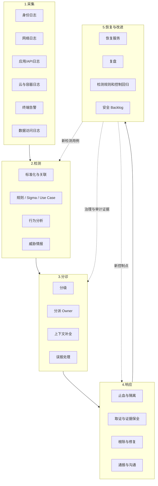

# 安全运营与事件响应闭环图

## 总图

## 关键指标

- MTTD：平均发现时间
- MTTR：平均恢复时间
- containment time：止血时间
- false positive rate：误报率
- recurrence rate：复发率
- playbook coverage：剧本覆盖率

## 关联

- [[../05-Topics/安全运营、检测与响应|安全运营、检测与响应]]
- [[../05-Topics/安全指标与成熟度模型|安全指标与成熟度模型]]
- [[../05-Topics/安全治理、风险与合规|安全治理、风险与合规]]
