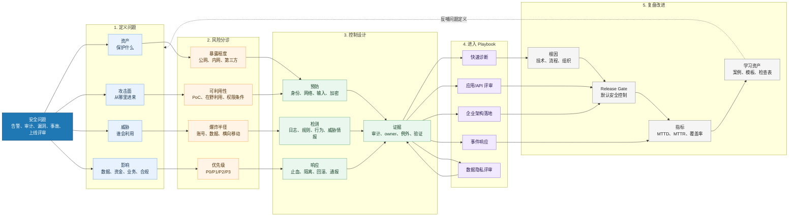

# 安全问题解决工作台

> 这张图回答一个问题：遇到一个真实安全问题时，如何从“现象”走到“风险判断、控制设计、响应闭环和长期改进”。

## 总图

## 怎么用

### 1. 不要先问“买什么工具”

先问四件事：

- 资产：什么东西被保护，owner 是谁？
- 攻击面：入口在哪里，是否暴露公网或第三方？
- 威胁：谁会打，怎么打，是否已经发生？
- 影响：数据、资金、客户、合规、品牌哪个受影响？

### 2. 再做风险分诊

安全优先级不只看漏洞分数，还要看：

- 暴露程度：公网 > 第三方可达 > 内网 > 本地
- 可利用性：在野利用 > 有 PoC > 理论可利用
- 爆炸半径：高权限、敏感数据、横向移动路径
- 业务时效：是否影响上线、审计、客户承诺或监管通报

### 3. 控制要成组出现

只做一个控制通常不够。成熟安全方案至少要回答：

- 预防：如何降低发生概率？
- 检测：发生后如何看见？
- 响应：看见后如何止血？
- 证据：如何证明控制有效？

### 4. 进入对应 Playbook

- 快速分诊：[[../08-Playbooks/安全快速诊断 Playbook|安全快速诊断 Playbook]]
- 企业落地：[[../08-Playbooks/企业安全架构落地 Playbook|企业安全架构落地 Playbook]]
- 应用/API：[[../08-Playbooks/应用与 API 安全评审 Playbook|应用与 API 安全评审 Playbook]]
- 事件响应：[[../08-Playbooks/安全事件响应 Playbook|安全事件响应 Playbook]]
- 数据隐私：[[../08-Playbooks/数据安全与隐私评审 Playbook|数据安全与隐私评审 Playbook]]

## 关键判断

真正能解决安全问题的人，不是“知道很多漏洞名”的人，而是能把问题稳定翻译成：

`资产 -> 攻击面 -> 威胁 -> 风险 -> 控制 -> 检测 -> 响应 -> 证据 -> 复盘`

这也是本知识库后续继续深挖的主线。

## 关联

- [[../安全问题导航|安全问题导航]]
- [[../安全决策导航|安全决策导航]]
- [[../08-Playbooks/Playbook 索引|Playbook 索引]]
- [[./安全上帝视角全景架构图|安全上帝视角全景架构图]]
