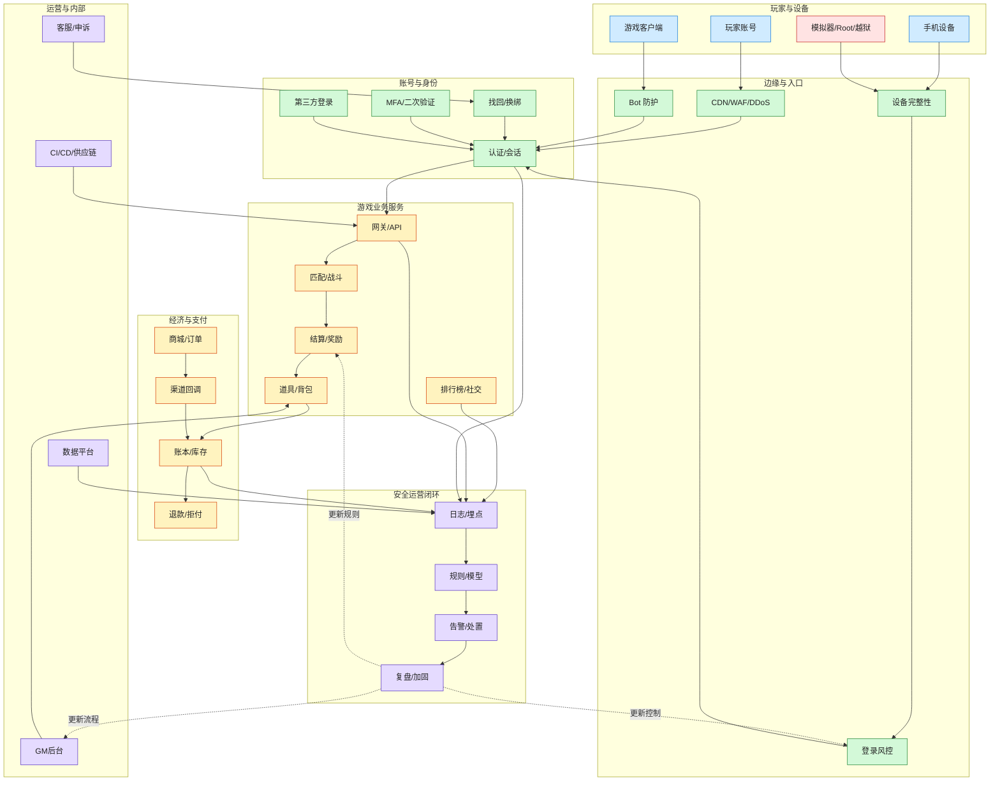

# 手机游戏端到端安全架构图

> 这张图回答：一家手机游戏公司从玩家设备到运营后台、从登录到支付、从反作弊到事件响应，端到端各环节会有什么问题、应该做什么、解决什么问题。

## 一句话判断

手机游戏安全不是“客户端加固 + 反外挂”这么窄，而是一套围绕 `账号资产、客户端完整性、游戏公平性、虚拟经济、支付充值、运营后台、数据隐私和安全运营` 的端到端风险控制系统。

## 读图方式

1. **玩家与设备**：攻击不只来自账号密码，也来自设备、模拟器、脚本、改包、Root/越狱环境。
2. **边缘与入口**：撞库、爬虫、DDoS、代理池、验证码农场和自动化脚本先打到入口层。
3. **账号与身份**：登录、会话、找回、换绑、第三方登录、MFA 是账号安全主战场。
4. **游戏业务服务**：匹配、战斗、结算、奖励、背包和排行榜决定公平性与经济安全。
5. **经济与支付**：商城、渠道回调、账本、退款、拒付决定真实损失。
6. **运营与内部**：GM 后台、客服、数据平台、CI/CD 是高权限与供应链风险面。
7. **安全运营闭环**：日志、规则、模型、告警、处置和复盘决定安全能力能不能持续进化。

## 端到端风险与控制矩阵

| 环节 | 典型问题 | 应该做什么 | 解决什么问题 |
|---|---|---|---|
| 登录入口 | 撞库、密码喷洒、代理池、验证码绕过 | 登录限速、风险评分、设备指纹、异常 IP/ASN/国家识别、泄露密码检测、分级验证码 | 降低账号接管成功率 |
| 账号体系 | 会话劫持、弱找回、换绑盗号、第三方登录滥用 | 短期 token、刷新 token 轮换、敏感操作二次验证、换绑冷却期、找回风险评估 | 防止盗号后快速转移资产 |
| 客户端 | 改包、Hook、调试、模拟器农场、脚本点击 | Play Integrity / App Attest、签名校验、反调试、资源完整性、关键逻辑服务端化 | 提高自动化与改包成本 |
| API 网关 | BOLA、越权、重放、接口枚举、参数篡改 | 服务端鉴权、对象级授权、nonce/timestamp、幂等、参数签名、schema 校验 | 防止绕过客户端直接打 API |
| 战斗/结算 | 加速、内存改值、战斗结果伪造、奖励篡改 | 服务端权威计算、战斗回放、异常行为模型、结算二次校验 | 保护公平性和奖励真实性 |
| 虚拟经济 | 刷币、重复领取、盗卖、黑产搬砖 | 账本化、库存一致性、产出/消耗监控、交易限额、异常路径冻结 | 控制经济系统损失扩散 |
| 支付充值 | 伪造回调、重复发货、退款套利、拒付 | 渠道验签、订单幂等、对账、退款风控、充值-消耗联动 | 防止直接经济损失 |
| 运营后台 | GM 越权、误操作、内部滥用、客服被钓鱼 | RBAC/PAM、审批、敏感操作双人复核、全量审计、客服最小权限 | 防止内部高权限成为攻击放大器 |
| 数据平台 | PII 泄露、日志过度采集、权限横移 | 数据分级、脱敏、最小化、访问审计、DLP、保留删除策略 | 降低隐私与合规风险 |
| CI/CD | SDK 投毒、密钥泄露、构建产物篡改 | SAST/SCA/Secrets、SBOM、签名发布、依赖锁定、制品库权限 | 防止供应链攻击进入客户端和服务端 |
| 安全运营 | 看不到攻击、响应慢、规则不复盘 | SIEM/日志平台、检测规则、值班流程、封禁/解封证据、Postmortem | 把安全从一次性处置变成持续能力 |

## 撞库场景下的优先控制点

撞库的本质是：攻击者拿外部泄露的账号密码，利用自动化和代理池批量尝试登录。如果成功登录，再转移账号资产、绑定信息、虚拟货币、道具、社交关系或支付权益。

优先顺序：

1. **看见攻击**：登录失败率、成功率、IP/ASN、设备、账号、渠道、版本、地理位置、代理特征。
2. **压低成功率**：分层限速、风险验证码、泄露密码检测、异常设备二次验证、可疑登录拦截。
3. **阻断资产转移**：换绑冷却、敏感操作二次验证、异常交易冻结、道具/货币转移限额。
4. **保护会话**：撤销可疑 session、刷新 token 轮换、异常设备下线。
5. **保留证据**：攻击样本、账号列表、IP/设备聚类、处置动作、用户影响范围。
6. **复盘补洞**：找回流程、客服流程、验证码策略、风控规则、账号安全提示。

## 不要踩的坑

- 不要只靠封 IP：代理池会换，必须同时看账号、设备、行为、ASN、速度和结果。
- 不要对所有玩家一刀切强验证码：会伤害正常用户，应该风险分层。
- 不要只保护登录，不保护换绑、道具转移、充值退款和客服找回。
- 不要只看失败登录：撞库成功后的资产转移才是真损失。
- 不要只封黑产账号，不沉淀规则、证据和复盘。
- 不要把客户端完整性当银弹：服务端必须做权威校验和风控。

## 推荐落地节奏

### 0-48 小时：止血

- 建 war room：账号、安全、服务端、客户端、运营、客服、数据、法务/合规。
- 拉登录与账号安全大盘：失败/成功、账号、IP、设备、ASN、渠道、版本、国家地区。
- 风险限速：按 IP、账号、设备、ASN、国家地区、登录结果做动态限速。
- 敏感操作保护：换绑、改密、道具转移、充值退款、账号找回增加二次验证或冷却期。
- 撤销可疑会话：对高风险成功登录做 session revoke 和 step-up。
- 客服话术和申诉证据：防止玩家恐慌，也防止黑产利用客服流程。

### 3-14 天：建立防线

- 接入或强化设备完整性：Android Play Integrity、iOS App Attest / DeviceCheck。
- 建账号风险评分：账号历史、设备历史、登录速度、IP 声誉、行为链路、资产变化。
- 建虚拟经济联动：登录风险命中后，限制交易、赠送、出售、换绑和大额消耗。
- 建检测规则：撞库、密码喷洒、异常登录成功、批量换绑、异常资产转移。
- 建复盘机制：每周看规则命中、误伤、成功盗号率、申诉量、资产损失。

### 30-90 天：体系化

- 账号安全平台化：统一认证、会话、设备、MFA、找回、风控、审计。
- 游戏风控平台化：账号、设备、客户端、战斗、经济、支付、社区统一画像。
- 安全数据闭环：日志规范、检测规则、case 管理、封禁证据、解封复核。
- 内部权限治理：GM 后台、客服后台、数据平台、CI/CD 最小权限与审计。
- 安全评审前置：登录、支付、经济、活动、补偿、排行榜、交易系统上线前威胁建模。

## 关联

- [[../03-Industry-Controls/游戏业务安全控制清单|游戏业务安全控制清单]]
- [[../08-Playbooks/手游撞库与账号安全治理 Playbook|手游撞库与账号安全治理 Playbook]]
- [[../05-Topics/身份与访问安全|身份与访问安全]]
- [[../05-Topics/客户端安全|客户端安全]]
- [[../05-Topics/应用安全与 API 安全|应用安全与 API 安全]]
- [[../05-Topics/安全运营、检测与响应|安全运营、检测与响应]]
- [[../08-Playbooks/安全事件响应 Playbook|安全事件响应 Playbook]]
