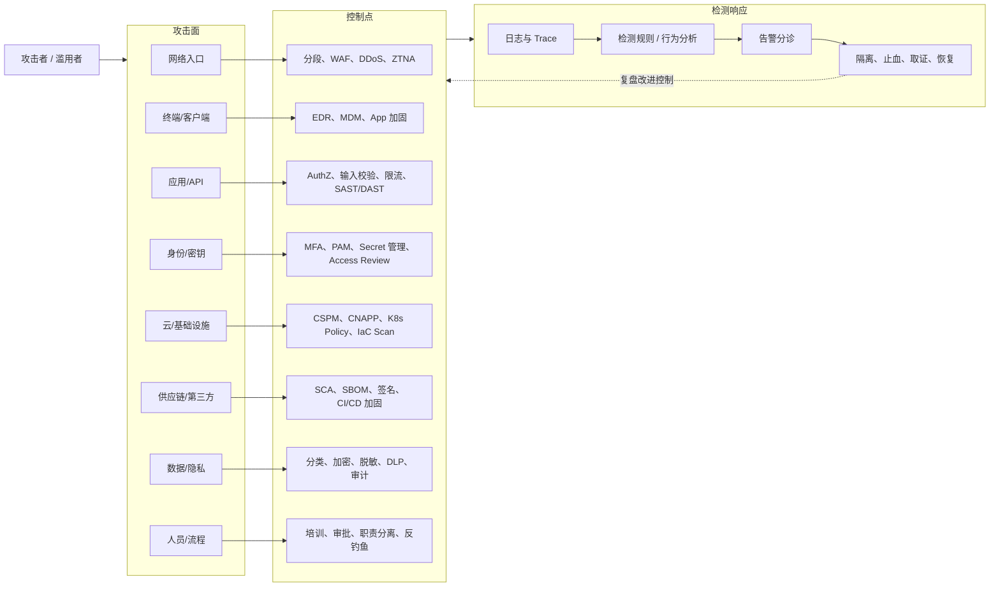

# 攻击面与控制点图

## 总图

## 用法

每遇到一个安全问题，按这个顺序问：

1. 它属于哪个攻击面
2. 已有哪些控制点
3. 哪个控制点缺失或失效
4. 有没有检测信号
5. 事件后如何复盘改进

## 关联

- [[../05-Topics/漏洞管理与攻击面管理|漏洞管理与攻击面管理]]
- [[../05-Topics/威胁建模|威胁建模]]
- [[../05-Topics/安全运营、检测与响应|安全运营、检测与响应]]
