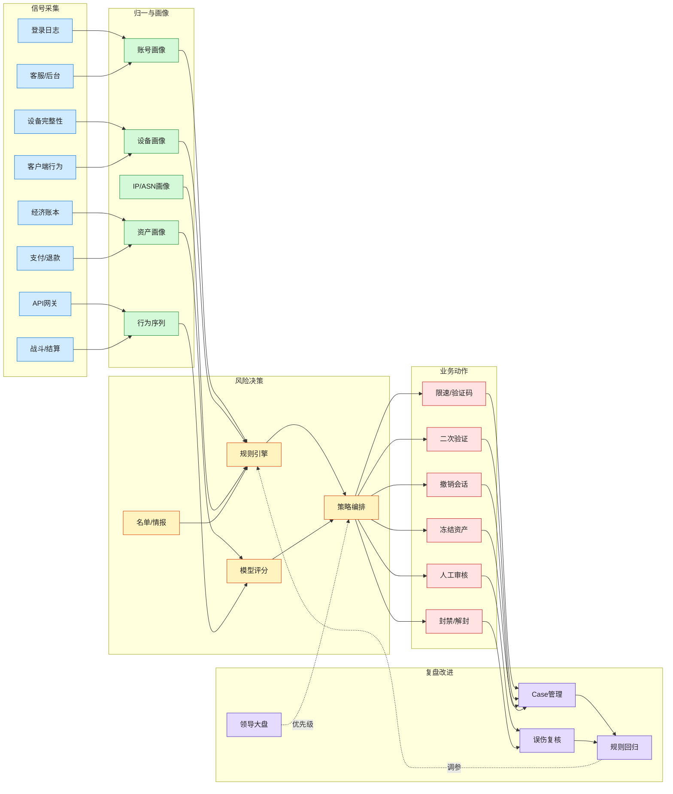

# 游戏账号风控数据链路图

> 这张图回答：撞库、盗号、外挂、经济套利和客服社工要靠哪些数据看见，如何从日志变成风险决策和业务动作。

## 最小可用数据集

| 数据源 | 必要字段 | 用途 |
|---|---|---|
| 登录 | account_id、ip、asn、geo、device_id、app_version、success、fail_reason、timestamp | 撞库、密码喷洒、ATO |
| 设备 | device_id、integrity_verdict、root/jailbreak、emulator、install_source、channel | 改包、设备农场、模拟器 |
| 会话 | session_id、account_id、device_id、created_at、revoked_at、risk_score | 会话撤销、异常下线 |
| 账号变更 | bind_change、password_change、recovery、mfa_change、old/new value hash | 换绑盗号、客服社工 |
| 经济 | account_id、role_id、item_id、currency_id、amount、source、sink、trace_id | 资产搬运、刷币、异常消耗 |
| 支付 | order_id、channel、amount、callback_signature、refund、chargeback、delivery_status | 伪造回调、退款套利 |
| 客服 | ticket_id、account_id、operator_id、source_ip、action、evidence_score | 社工、越权、误操作 |
| 后台 | operator_id、role、action、target_account、approval_id、before/after | GM 滥用、审计 |

## 核心关联键

最少要统一这些键：

- `account_id`
- `role_id`
- `device_id`
- `ip / asn / geo`
- `session_id`
- `trace_id`
- `order_id`
- `ticket_id`
- `operator_id`

没有统一关联键，安全团队只能看见“登录异常”；有了关联键，才能看见“异常登录后 12 分钟换绑、18 分钟转移道具、25 分钟发起客服申诉”。

## 风险评分维度

| 维度 | 示例 |
|---|---|
| 账号风险 | 高价值账号、历史被盗、弱密码、近期找回 |
| 设备风险 | 新设备、完整性失败、模拟器、Root/越狱、设备农场 |
| 网络风险 | 代理、IDC、异常 ASN、异常国家地区、高失败率 |
| 行为风险 | 登录后立即换绑、资产转移、退款、批量操作 |
| 经济风险 | 异常产出、异常消耗、异常交易路径、高价值道具流出 |
| 客服风险 | 找回材料复用、同源多账号、找回后敏感动作 |

## 策略动作分层

| 风险分 | 动作 |
|---|---|
| 低 | 放行、记录 |
| 中 | 限速、轻量验证码 |
| 高 | 二次验证、新设备确认、敏感操作冷却 |
| 严重 | 撤销会话、冻结资产、人工审核、客服升级 |
| 确认恶意 | 封禁、回滚、黑名单、情报沉淀 |

## 领导大盘视角

安全大盘不要只给技术指标，要能回答业务问题：

- 攻击规模：有多少账号被尝试？
- 防护效果：撞库成功率下降了吗？
- 损失控制：高风险成功登录后资产转移被拦住了吗？
- 用户体验：误伤率、申诉量、验证码触发率是否可接受？
- 运营效率：MTTD / MTTR 是否下降？
- 体系建设：哪些控制已上线，哪些还在排期？

## 关联

- [[./手机游戏端到端安全架构图|手机游戏端到端安全架构图]]
- [[../05-Topics/手机游戏安全深度拆解：账号、客户端、经济与运营|手机游戏安全深度拆解：账号、客户端、经济与运营]]
- [[../08-Playbooks/手游账号安全检测规则库|手游账号安全检测规则库]]
- [[../07-Templates/手游安全领导汇报与大盘模板|手游安全领导汇报与大盘模板]]
