# 红队蓝队紫队演练闭环图

> 这张图回答：如何把攻击链、检测工程、事件响应和治理改进合成一次安全演练，而不是各玩各的。

## 总图

```mermaid
flowchart LR
  Scope["授权范围<br/>目标、边界、规则"]

  subgraph Intel["威胁建模"]
    Assets["关键资产"]
    TTP["TTP 映射<br/>MITRE ATT&CK"]
    Risk["风险假设"]
  end

  subgraph Red["红队视角"]
    Emulate["对手模拟"]
    Path["攻击路径推演"]
    Findings["可利用路径"]
  end

  subgraph Blue["蓝队视角"]
    Logs["日志源"]
    Detect["检测规则"]
    Triage["告警分诊"]
    Respond["响应动作"]
  end

  subgraph Purple["紫队协同"]
    Exercise["联合演练"]
    Gap["覆盖缺口"]
    Tune["规则调优"]
    Evidence["证据沉淀"]
  end

  subgraph Improve["改进闭环"]
    Controls["控制改进"]
    Playbooks["Playbook 更新"]
    Metrics["指标"]
    Review["复盘"]
  end

  Scope --> Assets
  Assets --> TTP
  TTP --> Risk
  Risk --> Emulate
  Emulate --> Path
  Path --> Findings
  Findings --> Logs
  Logs --> Detect
  Detect --> Triage
  Triage --> Respond
  Respond --> Exercise
  Exercise --> Gap
  Gap --> Tune
  Tune --> Evidence
  Evidence --> Controls
  Controls --> Playbooks
  Playbooks --> Metrics
  Metrics --> Review
  Review -. "下一轮范围" .-> Scope

  classDef scope fill:#1f77b4,color:#fff,stroke:#0d3d66;
  classDef intel fill:#e8f2ff,stroke:#6aa3d8,color:#17324d;
  classDef red fill:#ffe8e8,stroke:#d96c6c,color:#4d1111;
  classDef blue fill:#e9f7ef,stroke:#62a878,color:#123d20;
  classDef purple fill:#f0e9ff,stroke:#8b6fd6,color:#24164d;
  classDef improve fill:#f5f5f5,stroke:#888,color:#222;

  class Scope scope;
  class Assets,TTP,Risk intel;
  class Emulate,Path,Findings red;
  class Logs,Detect,Triage,Respond blue;
  class Exercise,Gap,Tune,Evidence purple;
  class Controls,Playbooks,Metrics,Review improve;
```

## 怎么读

### 红队不是“随便打”

红队价值在于验证真实攻击路径，但必须有：

- 明确授权范围。
- 明确目标和规则。
- 明确禁止项。
- 明确演练窗口和联系人。
- 明确证据留存和停止条件。

### 蓝队不是“等告警”

蓝队价值在于把攻击路径转成可见信号：

- 必要日志源。
- 检测假设。
- 分诊上下文。
- 响应动作。
- 复盘改进。

### 紫队不是“红蓝一起开会”

紫队价值在于缩短反馈回路：

- 先定义场景。
- 再验证检测覆盖。
- 然后调优规则和 playbook。
- 最后沉淀控制和证据。

## 关键输出

- 演练计划。
- TTP 到检测覆盖矩阵。
- 事件时间线。
- 检测规则变更。
- 响应 playbook 更新。
- 控制改进 backlog。
- 管理层摘要。

## 官方框架入口

- MITRE ATT&CK：<https://attack.mitre.org/>
- MITRE D3FEND：<https://d3fend.mitre.org/>
- CISA Incident and Vulnerability Response Playbooks：<https://www.cisa.gov/news-events/news/incident-and-vulnerability-response-playbooks>
- NIST SP 800-61：<https://www.nist.gov/publications/computer-security-incident-handling-guide>

## 关联

- [[../08-Playbooks/红队蓝队紫队演练路径 Playbook|红队蓝队紫队演练路径 Playbook]]
- [[../08-Playbooks/SOC 检测工程 Playbook|SOC 检测工程 Playbook]]
- [[../08-Playbooks/安全事件响应 Playbook|安全事件响应 Playbook]]
- [[../07-Templates/安全演练计划模板|安全演练计划模板]]
- [[../07-Templates/检测覆盖矩阵模板|检测覆盖矩阵模板]]
