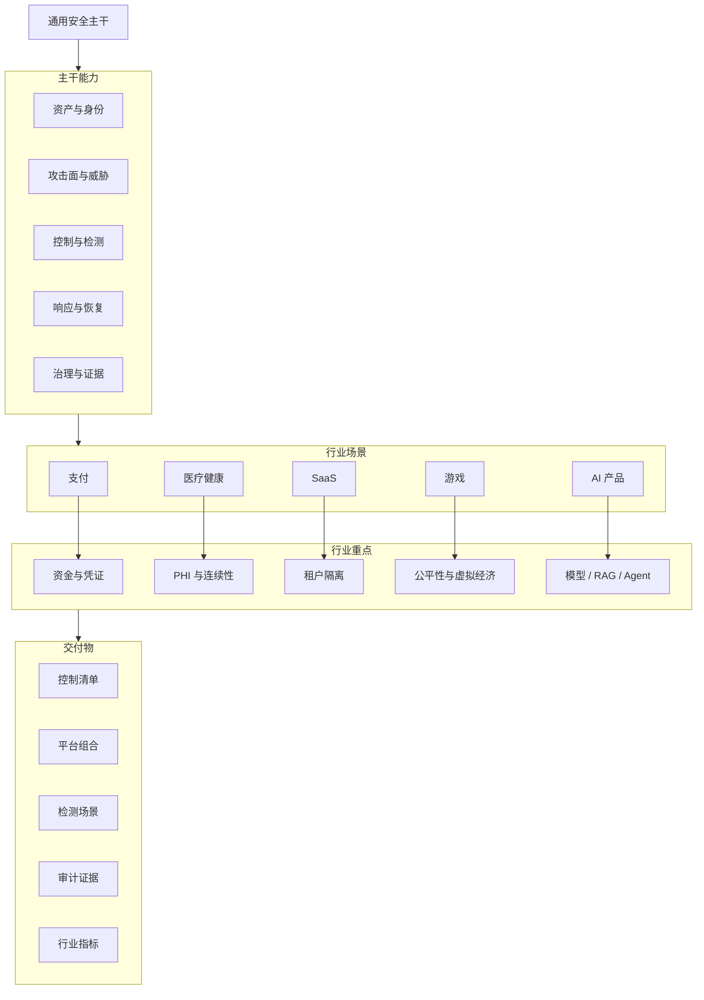

# 行业安全控制迁移地图

> 图类型：capability-map。它回答“通用安全能力如何迁移到不同行业和产品形态”。

## 读图方式

- 先掌握通用主干，再进入行业；不要一上来背行业术语。
- 行业不是改变安全基本原理，而是改变资产、威胁、优先级、证据和工具组合。
- 每个行业清单都应该能回答：保护什么、怕什么、怎么控、怎么检测、怎么证明。

## 行业切入点

| 行业 | 第一优先资产 | 第一优先风险 | 第一优先证据 |
|---|---|---|---|
| 支付 | 支付凭证、交易、资金账户 | 盗刷、卡数据泄露、交易篡改 | PCI DSS、交易日志、密钥记录 |
| 医疗 | PHI、临床系统、医疗设备 | 勒索、PHI 外泄、业务中断 | HIPAA 风险评估、访问审计 |
| SaaS | 租户数据、企业身份、云平台 | 租户越权、客户数据泄露 | SOC 2/ISO 证据、客户审计日志 |
| 游戏 | 账号、虚拟经济、客户端 | 外挂、盗号、经济套利 | 反作弊记录、风控 case、后台审计 |
| AI 产品 | prompt、知识库、模型、工具 | prompt injection、RAG 泄露、agent 越权 | AI eval、红队报告、工具调用审计 |

## 关联

- [[../03-Industry-Controls/行业控制清单索引|行业控制清单索引]]
- [[./安全点线面能力地图|安全点线面能力地图]]
- [[./安全工具平台能力地图|安全工具平台能力地图]]
- [[../02-Tools/工具平台分类索引|工具平台分类索引]]

