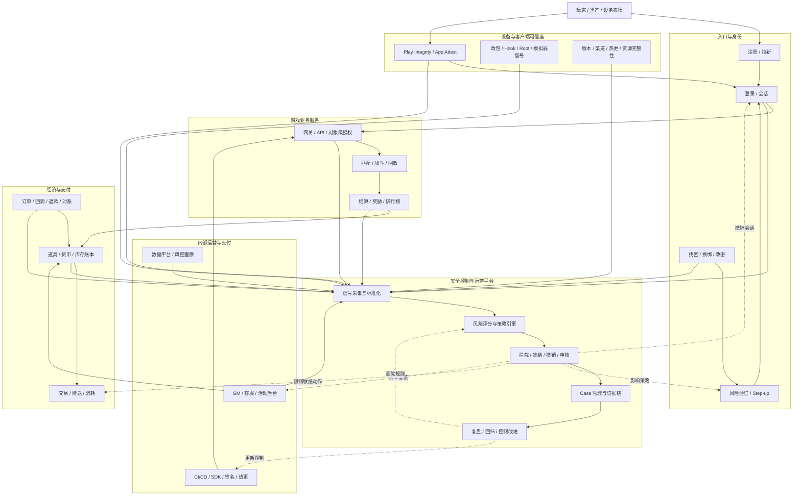

# 手机游戏端到端安全架构落地 Playbook

> 这份 Playbook 面向“公司最近被撞库，领导要求搞全局安全架构”的真实场景。它的目标不是列一堆安全名词，而是把手机游戏从玩家设备到运营后台、从登录到支付、从反作弊到安全运营，组织成一套能落地、能汇报、能复盘、能持续建设的端到端安全系统。

## 一句话定位

手机游戏端到端安全，本质是围绕 `账号资产、设备与客户端可信度、游戏公平性、虚拟经济、支付充值、运营后台、数据隐私、交付供应链、安全运营` 建一条风险闭环。

架构师要做的不是“把每个点都加固一下”，而是回答四个问题：

1. 黑产从哪里进来？
2. 进入后能造成什么业务损失？
3. 哪些控制能限制成功率和损失半径？
4. 哪些日志、规则、流程和指标能证明控制有效？

## 先给领导的架构答案

当领导问“我们全局安全架构怎么搞”时，不要只说验证码、封 IP、客户端加固。更好的回答是：

> 我们会把手游安全拆成三条主战线和五个支撑面。三条主战线是账号安全、游戏公平性、虚拟经济与支付安全；五个支撑面是客户端完整性、API 与服务端权威、运营后台与客服安全、数据与合规、检测响应与治理。短期先止血撞库和账号接管，中期打通账号、设备、行为、经济、客服、支付的数据链路，长期建设账号风控、反作弊、经济风控、后台审计和安全运营平台。

## 端到端攻击面

| 环节 | 主要问题 | 为什么会变成业务损失 | 核心控制 |
|---|---|---|---|
| 注册与拉新 | 批量注册、小号农场、羊毛党 | 活动成本被薅、黑产沉淀账号池 | 设备画像、渠道校验、注册限速、号码风险、活动风控 |
| 登录 | 撞库、密码喷洒、代理池自动化 | 账号接管、资产搬运、客服压力、舆情 | 多维限速、泄露密码检测、风险验证码、step-up、会话撤销 |
| 账号找回与换绑 | 社工、找回材料复用、盗号后接管 | 用户彻底失去账号控制权 | 证据强度分级、冷却期、旧设备通知、人工复核、敏感动作冻结 |
| 设备与客户端 | 改包、Hook、Root/越狱、模拟器、脚本 | 自动化、外挂、绕过本地校验、刷资源 | Play Integrity、App Attest/DeviceCheck、签名校验、资源完整性、RASP 信号 |
| API 与网关 | 越权、重放、参数篡改、接口滥用 | 直接操作他人资产或绕过业务规则 | 对象级授权、幂等、nonce、schema 校验、行为限速、trace id |
| 战斗与匹配 | 加速、内存改值、封包篡改、外挂 | 破坏公平、玩家流失、排行榜失真 | 服务端权威、回放校验、异常行为模型、延迟结算、封禁复核 |
| 结算与奖励 | 重复发奖、伪造结果、活动套利 | 虚拟货币通胀、道具黑市、活动成本失控 | 结算幂等、奖励账本、异常产出检测、活动规则评审 |
| 虚拟经济 | 刷币、搬砖、资产转移、黑市交易 | 经济系统失衡、玩家信任下降 | 账本化、交易限额、风险冻结、资产流向图、经济健康指标 |
| 支付与退款 | 伪造回调、重放订单、退款套利、拒付 | 直接资金损失、渠道处罚、重复发货 | 渠道验签、订单幂等、对账、退款联动、支付风控 |
| 运营后台 | GM 越权、客服社工、误操作、内部滥用 | 单点权限放大所有技术风险 | RBAC/PAM、MFA、审批、双人复核、全量审计、异常操作告警 |
| 数据平台 | PII 泄露、越权查询、画像滥用 | 隐私合规、舆情、监管风险 | 数据分级、脱敏、最小权限、查询审计、留存删除 |
| CI/CD 与供应链 | SDK 投毒、密钥泄露、构建篡改、热更污染 | 恶意版本进入生产，影响全量玩家 | SAST/SCA/Secrets、SBOM、签名发布、制品权限、热更审批 |
| 安全运营 | 看不见、响应慢、误伤大、规则不可复盘 | 攻击持续扩大，组织无法学习 | 日志标准化、检测规则、Case 管理、MTTD/MTTR、复盘回归 |

## 端到端落地图



## 控制平面：不要只做“防”，要做闭环

### 1. Signal Plane：信号采集面

最低要采集：

- 账号：`account_id`、`role_id`、账号年龄、绑定状态、MFA、历史风险。
- 设备：`device_id`、设备指纹、完整性 verdict、Root/越狱、模拟器、安装来源、渠道。
- 网络：IP、ASN、Geo、代理/IDC、失败率、请求频率。
- 客户端：版本、渠道包、签名、资源 hash、热更版本、异常模块。
- 行为：登录、换绑、改密、找回、交易、赠送、消耗、退款、客服工单。
- 经济：货币产消、道具流向、库存变更、交易链路、排行榜变化。
- 内部：GM 操作、客服操作、审批、工单、数据查询、发布变更。
- 证据：`trace_id`、`operation_id`、`ticket_id`、`order_id`、处置前后状态。

### 2. Decision Plane：风险决策面

风险决策不要做成单点规则，而要形成策略引擎：

- `账号风险`：弱密码、泄露密码命中、历史被盗、高价值账号、新设备。
- `设备风险`：完整性失败、模拟器、Root/越狱、设备农场、重复滥用设备。
- `网络风险`：代理池、IDC、异常 ASN、跨地域跳变、高失败率。
- `行为风险`：登录后立刻换绑、资产转移、退款、找回、批量操作。
- `经济风险`：异常产出、异常赠送、异常消耗、异常流向、黑市特征。
- `内部风险`：非工作时间高危操作、无审批操作、批量补偿、客服异常找回。

### 3. Action Plane：动作执行面

风险动作要分层，避免“一刀切”：

| 风险级别 | 动作 | 适用场景 |
|---|---|---|
| 观察 | 记录、打标签、进入画像 | 新规则 shadow、低置信度异常 |
| 轻干预 | 限速、验证码、降低接口额度 | 撞库扫描、自动化尝试 |
| 强验证 | MFA、旧设备确认、平台二次验证 | 新设备登录、高价值账号、敏感动作 |
| 限制损失 | 冻结交易、延迟换绑、撤销 session、暂停退款 | 账号接管后疑似资产搬运 |
| 人工复核 | 客服升级、运营审核、风控 Case | 证据不充分但影响大 |
| 确认处置 | 封禁、回滚、黑名单、样本沉淀 | 确认外挂、刷币、黑产链路 |

### 4. Evidence Plane：证据与复盘面

每个高危处置都要留下证据：

- 为什么触发：规则 ID、风险分、命中信号。
- 影响了谁：账号、角色、设备、订单、道具、工单。
- 做了什么：撤销、冻结、封禁、回滚、通知、人工审核。
- 结果如何：误伤、申诉、损失降低、黑产绕过。
- 如何改进：规则调优、代码修复、流程变更、上线门禁。

## 重点链路 1：撞库到账号接管

### 攻击链

```text
外部泄露账号密码 -> 代理池批量尝试 -> 少量成功登录 -> 新设备接管 -> 换绑/改密/下线原设备 -> 资产搬运/退款/客服申诉
```

### 控制链

- 登录前：泄露密码检测、弱密码治理、注册/登录多维限速。
- 登录中：风险验证码、设备完整性、异常 ASN/代理识别、失败模式检测。
- 登录后：新设备 step-up、敏感操作冷却、session 撤销、用户通知。
- 损失控制：资产冻结、交易限额、找回升级、退款人工审核。
- 复盘：攻击样本聚类、规则回归、客服话术、玩家公告。

### 架构要点

撞库的核心不是“失败登录多”，而是“成功登录后能不能快速扩大损失”。所以账号安全必须联动经济、客服和支付，不能只停在登录接口。

## 重点链路 2：客户端可信度与反外挂

### 攻击链

```text
改包/Hook/Root/越狱/模拟器/脚本 -> 绕过本地逻辑 -> 自动化任务/战斗作弊/资源产出 -> 黑市变现
```

### 控制链

- 客户端只提供信号，不承担最终信任。
- Android 用 Play Integrity 获取 app、device、account 等 verdict，服务端验证并进入风险评分。
- iOS 用 App Attest / DeviceCheck 做设备和 App 实例相关信号，保护敏感 API。
- 核心战斗、奖励、库存、支付和活动规则必须服务端权威。
- 对完整性失败、模拟器、异常版本、Hook 信号做分层策略：观察、限制、隔离、封禁。

### 架构要点

客户端安全不是“加固后就可信”，而是把客户端变成风险信号源；真正的业务决策必须在服务端完成。

## 重点链路 3：战斗、结算与排行榜公平性

### 攻击链

```text
速度修改/内存修改/封包篡改 -> 伪造战斗过程或结果 -> 异常结算 -> 排行榜/段位/奖励收益
```

### 控制链

- 服务端权威计算关键状态，客户端只提交输入或可验证结果。
- 战斗回放和关键帧用于事后复核。
- 结算做幂等、签名、时序校验和异常奖励检测。
- 排行榜延迟发布，高风险成绩进入复核队列。
- 封禁要区分外挂确认、疑似异常、误伤观察，避免伤害正常玩家。

## 重点链路 4：虚拟经济与支付

### 攻击链

```text
异常产出/盗号资产搬运/退款套利/伪造回调 -> 货币道具流出 -> 黑市交易 -> 经济系统失衡
```

### 控制链

- 所有货币、道具、奖励、充值、退款都进入账本。
- 订单回调必须验签，发货必须幂等，对账必须能回溯。
- 高风险登录后限制赠送、交易、出售、大额消耗和退款。
- 经济看板同时看产出、消耗、转移、持有、黑市关联和退款。
- 资产回滚要保留证据，避免二次伤害。

## 重点链路 5：运营后台、客服与内部权限

### 攻击链

```text
社工客服/内部账号被盗/权限过大/审批缺失 -> 改绑/补偿/发道具/解封/查数据 -> 绕过业务系统防线
```

### 控制链

- 员工和后台账号必须 MFA。
- GM、客服、活动、数据平台按最小权限拆角色。
- 发道具、解封、改绑、补偿、批量查询必须审批与双人复核。
- 高危操作全量审计，关联账号风险、工单和资产变化。
- 离职、转岗、外包、临时权限必须有生命周期。

## 30/60/90 天落地路线

### 0-2 小时：止血

- 开 war room：安全、账号、后端、客户端、数据、客服、支付、运营、法务。
- 拉攻击大盘：尝试量、成功量、Top IP/ASN/设备/地区/版本/渠道、高价值账号。
- 上低误伤限速：IP/ASN/设备/账号多维限速，失败高发指数退避。
- 保护敏感动作：换绑、改密、交易、赠送、退款、客服找回加 step-up 或冻结。
- 保全证据：登录、会话、换绑、经济、支付、客服、后台日志统一导出。

### 2-24 小时：确认影响面

- 确认哪些账号被尝试、哪些成功、哪些发生敏感动作。
- 聚类攻击来源：IP、ASN、设备簇、App 版本、渠道、完整性 verdict。
- 估算损失：资产转移、退款、道具、客服工单、误伤和舆情。
- 分层处置：高风险账号撤销 session，中风险 step-up，低风险通知观察。
- 给领导日报：攻击规模、防护动作、已知损失、风险趋势、下一步。

### 1-7 天：补关键控制

- 接入或强化设备完整性信号：Play Integrity、App Attest / DeviceCheck。
- 建立账号风险评分：账号、设备、网络、行为、经济、客服联动。
- 建立资产保护策略：高风险登录后交易/赠送/退款/换绑冷却。
- 打通最小数据链路：登录、会话、账号变更、经济账本、支付、客服、后台。
- 完成撞库检测规则库第一版和误伤复核流程。

### 7-30 天：形成平台雏形

- 建 `账号安全与风控中心`：信号、策略、动作、Case、指标。
- 建 `游戏经济风控`：货币产消、异常转移、退款套利、黑市路径。
- 建 `客户端风险服务`：完整性 verdict、版本渠道、模拟器、Hook、异常模块。
- 建 `后台审计与高危操作治理`：审批、PAM、全量审计、异常操作告警。
- 建 `领导安全大盘`：攻击规模、成功率、损失、误伤、响应时间、控制上线率。

### 30-90 天：体系化

- 把账号风控、反作弊、经济风控、支付风控、客服风控和后台审计接成统一 Case。
- 把安全评审嵌入版本发布、活动上线、经济规则调整、SDK 接入和热更流程。
- 用红蓝紫演练验证：撞库、盗号、外挂、刷币、退款套利、GM 滥用、SDK 风险。
- 建立规则回归：每次黑产绕过后，沉淀新规则、新日志源、新上线门禁。
- 建立 GRC 证据：控制矩阵、责任人、审计日志、事件复盘、例外审批。

## 能力建设优先级

| 优先级 | 能力 | 为什么先做 |
|---|---|---|
| P0 | 登录限速、step-up、session 撤销、敏感动作冻结 | 直接降低撞库成功后的损失 |
| P0 | 登录、设备、经济、客服、支付关联键 | 没有数据链路就无法判断真实影响 |
| P0 | 客服找回与换绑冷却 | 黑产常通过流程接管账号 |
| P1 | Play Integrity / App Attest 信号服务端验证 | 客户端与设备可信度是反自动化基础 |
| P1 | 经济账本与资产冻结 | 控制盗号和外挂后的变现路径 |
| P1 | GM/PAM/后台高危审计 | 内部权限是最大放大器 |
| P2 | 反作弊行为模型与回放复核 | 维护公平性和玩家体验 |
| P2 | 供应链与热更门禁 | 防止风险进入全量客户端 |
| P2 | SIEM/Case/复盘指标 | 让安全从救火变成组织能力 |

## 架构师交付物

你可以把下面这些交给领导或团队：

- 一张图：[[../06-Maps/手机游戏端到端安全架构图|手机游戏端到端安全架构图]]
- 一张矩阵：[[../03-Industry-Controls/手机游戏端到端安全控制矩阵|手机游戏端到端安全控制矩阵]]
- 一个 Playbook：[[./手游撞库与账号安全治理 Playbook|手游撞库与账号安全治理 Playbook]]
- 一个规则库：[[./手游账号安全检测规则库|手游账号安全检测规则库]]
- 一个大盘模板：[[../07-Templates/手游安全领导汇报与大盘模板|手游安全领导汇报与大盘模板]]
- 一份路线图：本页 `30/60/90 天落地路线`

## 判断是否建设到位

### L0：被动救火

- 只能看到登录失败量。
- 靠封 IP 和全局验证码止血。
- 不知道成功登录后发生了什么。

### L1：单点防护

- 有登录限速、验证码、设备记录。
- 但账号、资产、客服、支付没有联动。
- 攻击来了可以缓解，但难以复盘。

### L2：链路联动

- 新设备登录能影响换绑、交易、退款和客服。
- 能串起 `登录 -> 会话 -> 资产 -> 工单 -> 支付`。
- 能做分层处置和误伤复核。

### L3：平台化

- 有账号风控、客户端风险、经济风控、后台审计和 Case 管理。
- 策略可配置，规则可回归，证据可审计。
- 安全能参与版本、活动、经济规则和 SDK 上线评审。

### L4：对抗运营

- 有黑产样本、攻击链演练、规则回归、威胁情报和成熟指标。
- 能持续降低攻击成功率、损失半径和响应时间。
- 安全成为业务韧性的一部分，而不是事故后的临时动作。

## 官方参考入口

- [OWASP MASVS](https://mas.owasp.org/MASVS/)：移动应用安全验证标准，覆盖 storage、crypto、auth、network、platform、code、resilience、privacy。
- [OWASP ASVS](https://owasp.org/www-project-application-security-verification-standard/)：应用安全验证标准，适合 API、认证、授权、会话、业务系统评审。
- [OWASP Credential Stuffing Prevention Cheat Sheet](https://cheatsheetseries.owasp.org/cheatsheets/Credential_Stuffing_Prevention_Cheat_Sheet.html)：撞库防护基线。
- [OWASP Automated Threats to Web Applications](https://owasp.org/www-project-automated-threats-to-web-applications/)：自动化滥用、机器人和业务滥用分类。
- [MITRE ATT&CK Mobile](https://attack.mitre.org/matrices/mobile/)：移动端攻击技术矩阵，可用于威胁建模和检测覆盖。
- [NIST SSDF SP 800-218](https://csrc.nist.gov/pubs/sp/800/218/final)：安全软件开发框架，适合 CI/CD、供应链和发布门禁。
- [Google Play Integrity API](https://developer.android.com/google/play/integrity/overview)：Android App、设备、账号和滥用风险信号。
- [Apple DeviceCheck / App Attest](https://developer.apple.com/documentation/devicecheck)：iOS 设备与 App 实例相关安全能力入口。

## 关联

- [[../06-Maps/手机游戏端到端安全架构图|手机游戏端到端安全架构图]]
- [[../05-Topics/手机游戏安全深度拆解：账号、客户端、经济与运营|手机游戏安全深度拆解：账号、客户端、经济与运营]]
- [[../06-Maps/游戏账号风控数据链路图|游戏账号风控数据链路图]]
- [[../03-Industry-Controls/手机游戏端到端安全控制矩阵|手机游戏端到端安全控制矩阵]]
- [[./手游撞库与账号安全治理 Playbook|手游撞库与账号安全治理 Playbook]]
- [[./手游账号安全检测规则库|手游账号安全检测规则库]]
- [[./安全事件响应 Playbook|安全事件响应 Playbook]]
- [[./应用与 API 安全评审 Playbook|应用与 API 安全评审 Playbook]]
- [[./供应链安全评审 Playbook|供应链安全评审 Playbook]]
- [[../07-Templates/手游安全领导汇报与大盘模板|手游安全领导汇报与大盘模板]]
