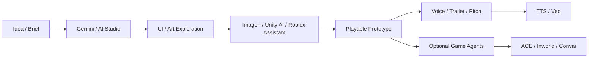

# AI 原生游戏制作技术图

```mermaid
flowchart LR
  A["Idea / Brief"] --> B["Gemini / AI Studio"]
  B --> C["UI / Art Exploration"]
  C --> D["Imagen / Unity AI / Roblox Assistant"]
  D --> E["Playable Prototype"]
  E --> F["Voice / Trailer / Pitch"]
  F --> G["TTS / Veo"]
  E --> H["Optional Game Agents"]
  H --> I["ACE / Inworld / Convai"]
```
