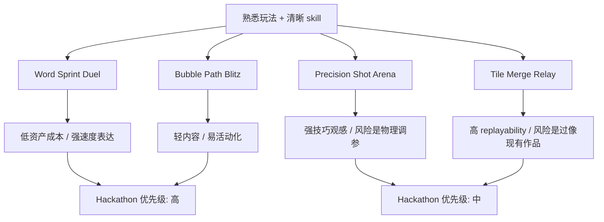

# Hackathon 候选游戏方向图

```mermaid
flowchart TD
  A["熟悉玩法 + 清晰 skill"] --> B["Word Sprint Duel"]
  A --> C["Bubble Path Blitz"]
  A --> D["Precision Shot Arena"]
  A --> E["Tile Merge Relay"]

  B --> F["低资产成本 / 强速度表达"]
  C --> G["轻内容 / 易活动化"]
  D --> H["强技巧观感 / 风险是物理调参"]
  E --> I["高 replayability / 风险是过像现有作品"]

  F --> J["Hackathon 优先级: 高"]
  G --> J
  H --> K["Hackathon 优先级: 中"]
  I --> K
```
