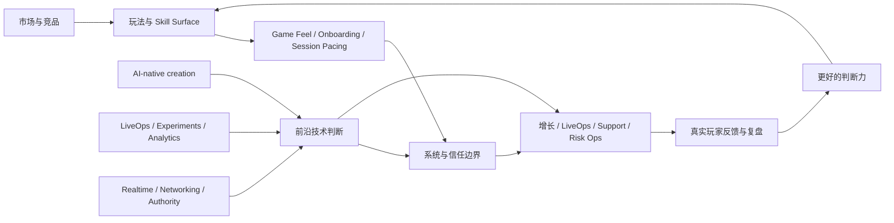

# Skills Gaming 专家成长与前沿技术图

## 推荐顺序

1. [[../05-Topics/什么是 Skills Gaming|什么是 Skills Gaming]]
2. [[../01-Market/欧美 Skills Gaming 市场与竞品格局|欧美 Skills Gaming 市场与竞品格局]]
3. [[../05-Topics/适合 Skills Gaming 的玩法原型|适合 Skills Gaming 的玩法原型]]
4. [[../05-Topics/Game Feel、Onboarding 与 First Match Design|Game Feel、Onboarding 与 First Match Design]]
5. [[../05-Topics/Session Pacing、Replayability 与 Skill Expression|Session Pacing、Replayability 与 Skill Expression]]
6. [[../05-Topics/Skills Gaming 的失败模式、争议与 Anti-Cheat 复盘|Skills Gaming 的失败模式、争议与 Anti-Cheat 复盘]]
7. [[../05-Topics/前沿游戏技术全景：AI、LiveOps、Realtime 与创作者工具|前沿游戏技术全景：AI、LiveOps、Realtime 与创作者工具]]
8. [[../08-Playbooks/从知识框架到 Skills Gaming 专家的 90 天路径|从知识框架到 Skills Gaming 专家的 90 天路径]]
9. [[../10-Projects/Hackathon Game/项目总览|Hackathon Game]]
