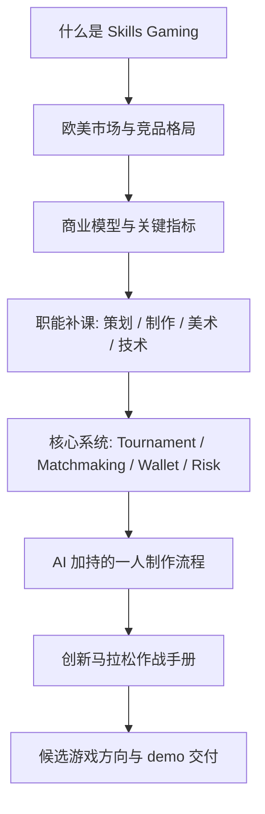

# Skills Gaming 学习路径图

```mermaid
flowchart TD
  A["什么是 Skills Gaming"] --> B["欧美市场与竞品格局"]
  B --> C["商业模型与关键指标"]
  C --> D["职能补课: 策划 / 制作 / 美术 / 技术"]
  D --> E["核心系统: Tournament / Matchmaking / Wallet / Risk"]
  E --> F["AI 加持的一人制作流程"]
  F --> G["创新马拉松作战手册"]
  G --> H["候选游戏方向与 demo 交付"]
```
