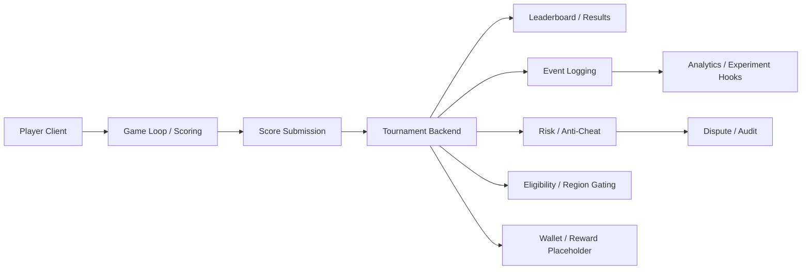

# Skills Gaming 技术架构图

```mermaid
flowchart LR
  U["Player Client"] --> G["Game Loop / Scoring"]
  G --> S["Score Submission"]
  S --> T["Tournament Backend"]
  T --> L["Leaderboard / Results"]
  T --> E["Event Logging"]
  T --> R["Risk / Anti-Cheat"]
  T --> P["Eligibility / Region Gating"]
  T --> W["Wallet / Reward Placeholder"]
  E --> A["Analytics / Experiment Hooks"]
  R --> D["Dispute / Audit"]
```
