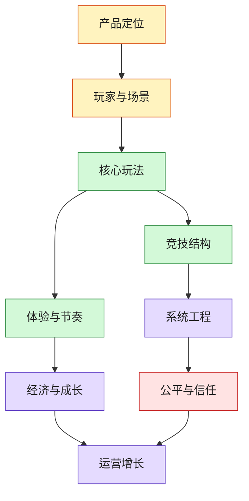

# 休闲竞技游戏全景架构图

> 这张图回答：如果从上帝视角看一款休闲竞技游戏，它到底由哪些层组成？策划、程序、美术、运营、商业、风控分别在设计什么？

## 九层结构

| 层级 | 核心问题 | 关键产物 |
|---|---|---|
| 产品定位 | 这是什么游戏，为谁解决什么娱乐需求？ | 用户画像、场景、竞品、差异化 |
| 玩家与场景 | 玩家为什么打开、什么时候玩、愿意玩多久？ | session 场景、设备、心流预期 |
| 核心玩法 | 玩家每 5-30 秒在做什么？ | core loop、操作、目标、反馈 |
| 竞技结构 | 玩家如何比较输赢和技能？ | 对战、排行、积分、锦标赛、异步比较 |
| 体验与节奏 | 是否上手快、反馈爽、失败想再来？ | onboarding、game feel、pacing、结果页 |
| 系统工程 | 玩法如何被稳定、公平、可观测地运行？ | 匹配、计分、回放、埋点、反作弊 |
| 经济与成长 | 为什么长期玩、为什么付费或参与活动？ | progression、奖励、任务、商店 |
| 运营增长 | 如何获取、留存、召回和迭代？ | UA、LiveOps、活动、A/B、分层运营 |
| 公平与信任 | 玩家为什么相信比赛和奖励？ | fairness、anti-cheat、争议处理、合规 |

## 全局判断

休闲竞技游戏不是“休闲 + 竞技”的简单相加，而是一个张力系统：

- **休闲**要求低门槛、短 session、快反馈、低压力。
- **竞技**要求可比较、可进步、有输赢、有公平感。
- 好的休闲竞技，是让玩家“很容易开始，但一直觉得自己还能变强”。

## 与 Skills Gaming 的关系

`skills gaming` 是休闲竞技的一种更强约束版本：

- 必须证明结果主要来自技能，而不是随机。
- 必须更重视公平性、计分可信、争议处理、风控和地区/平台边界。
- 如果涉及 real-money、entry fee、prize，则会进入更强的合规和信任系统。

所以本图可以作为整个 `Skills-Gaming` 子库的上层抽象：先理解休闲竞技，再进入真钱技能游戏的特殊约束。

## 推荐 Drill-down

- [[../05-Topics/休闲、竞技与技能表达|休闲、竞技与技能表达]]
- [[../05-Topics/竞技类型与玩法分类|竞技类型与玩法分类]]
- [[../05-Topics/休闲竞技游戏全景|休闲竞技游戏全景]]
- [[../08-Playbooks/休闲竞技游戏从想法到上线步骤|休闲竞技游戏从想法到上线步骤]]
- [[../05-Topics/Game Feel、Onboarding 与 First Match Design|Game Feel、Onboarding 与 First Match Design]]

