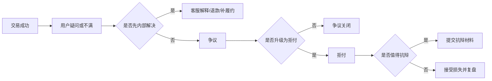

# 拒付、争议与抗辩

## 这页为什么关键

如果做的是卡支付或跨境收单，拒付（`Chargeback`）几乎一定会成为你们要长期管理的核心问题。

## 你先要抓住什么

- 用户投诉、争议、退款、拒付不是一回事
- 拒付会带来直接资金损失、额外费用、运营成本和通道风险
- 抗辩（`Representment`）不是每一笔都值得做，需要算投入产出
- 很多拒付其实在更早的客服、退款、履约和账单描述环节就能被预防

## 一条完整链路

## 你真正要关注的指标

- 拒付率
- 拒付原因分布
- 抗辩成功率
- 拒付处理时效
- 可预防拒付占比
- 拒付导致的总损失和附加费用

## 拒付通常来自哪些原因

### 未授权交易

通常和盗刷、账户接管、认证不足有关。

### 持卡人认不出扣款

通常和账单描述、品牌识别、续费提醒、客服响应慢有关。

### 商品或服务争议

通常和履约证据、交付证明、服务记录有关。

### 重复扣款或金额不符

通常和幂等、续费逻辑、系统配置和退款流程有关。

## 什么情况下更值得抗辩

- 原因码清晰且证据充分
- 订单金额较高
- 履约和用户确认记录完备
- 抗辩成本可接受
- 抗辩成功后对业务和通道关系有明显收益

## 什么情况下不如早点退款

- 订单金额很小
- 证据明显不足
- 用户确实存在合理不满
- 抗辩成功概率低
- 延迟处理会进一步恶化用户体验或通道表现

## 业务案例

### 案例 1：账单描述不清，拒付率持续偏高

场景：商户明明没有明显欺诈问题，但“持卡人不认识这笔交易”类拒付长期偏高。

真正的原因往往不是风控失效，而是：

- 账单描述没有体现品牌名
- 用户在下单时看到的品牌名和账单上不一致
- 续费提醒不清晰
- 客服入口难找，用户直接走发卡行申诉

这类问题最有效的治理动作，往往不是更强风控，而是更好的前台沟通和售后设计。

### 案例 2：团队很努力抗辩，但总收益并不高

场景：运营同学几乎每一笔拒付都尝试抗辩，工作量很大，但整体胜诉率不高，成本很重。

成熟团队会重构策略：

- 先按原因码分层
- 先做“值得抗辩”的筛选
- 对低价值、低胜率 case 直接接受损失并沉淀复盘
- 把精力放在高价值、高证据质量的案件上

## 一个检查清单

- 是否区分了退款、争议和拒付
- 是否建立了拒付原因码分类
- 是否有账单描述与续费提醒规范
- 是否沉淀了抗辩证据模板
- 是否区分了“值得抗辩”和“不值得抗辩”的案件
- 是否把拒付结果反哺到风控、产品和履约

## 常见治理方向

- 降低盗刷和未授权交易
- 优化账单描述，减少“用户看不懂是谁扣的钱”
- 做好履约证据、发货证据、服务记录留存
- 根据原因码决定是否发起抗辩
- 把客服和退款前移，尽量在拒付前消化问题

## 常见误区

- 把所有拒付都当成欺诈
- 把所有拒付都拉去抗辩
- 只盯抗辩成功率，不看可预防拒付比例
- 不把履约和客服团队纳入拒付治理

## 最关键的一句话

真正成熟的拒付治理，不是“抗辩能力很强”，而是尽量让问题别走到拒付这一步。

## 相关

- [[支付风控与封控]]
- [[3DS 与认证策略]]
- [[支付监控与告警]]
- [[拒付抗辩证据清单]]
- [[退款、争议与拒付全流程]]
