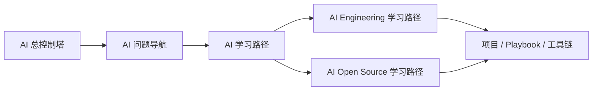

# AI 学习入口

这页只服务 AI 学习和研究，不混入整个知识库的系统说明。

## 如果你只有 15 分钟

| 想理解什么 | 先看 |
|---|---|
| AI 全局怎么分层 | [[10-Knowledge/AI/00-Navigation/AI 总控制塔]] |
| 我现在的问题该归到哪 | [[10-Knowledge/AI/00-Navigation/AI 问题导航]] |
| Workflow、Agent、工具链怎么选 | [[10-Knowledge/AI/00-Navigation/AI 决策导航]] |
| AI 学习主路径 | [[10-Knowledge/AI/学习路径]] |

## 四条主线

| 主线 | 入口 | 你会获得什么 |
|---|---|---|
| AI Foundations | [[10-Knowledge/AI-Foundations/专题总览]] | 历史、范式、基础概念、经典论文 |
| AI Learning | [[10-Knowledge/AI/专题总览]] | 模型、人物、公司、论文、新闻、系统 |
| AI Engineering | [[10-Knowledge/AI-Engineering/专题总览]] | 工程栈、框架、训练、评估、部署、AgentOps |
| AI Applications | [[10-Knowledge/AI-Applications/专题总览]] | 行业、产品、workflow、案例、落地风险 |

## 关键问题入口

| 问题 | 入口 |
|---|---|
| 我想搭 Agent | [[10-Knowledge/AI/00-Navigation/我想搭 Agent]] |
| 我想做 LLMOps 与 AgentOps | [[10-Knowledge/AI/00-Navigation/我想做 LLMOps 与 AgentOps]] |
| 我想快速理解 AI 基础设施 / MLOps 平台 | [[10-Knowledge/AI-Engineering/07-Topics/AI 基础设施平台学习框架]] |
| 我想选 AI 开源栈 | [[10-Knowledge/AI/00-Navigation/我想选 AI 开源栈]] |
| 我想做 AI Security | [[10-Knowledge/AI/00-Navigation/我想做 AI Security]] |
| 我想理解 AI 记忆与自改进 | [[10-Knowledge/AI/00-Navigation/我想理解 AI 记忆与自改进]] |
| 我想把 Mac 变成 AI 实验室 | [[10-Knowledge/AI/00-Navigation/我想把 Mac 变成 AI 实验室]] |
| 我想系统掌握模型、训练、微调和部署 | [[10-Knowledge/AI-Engineering/06-Projects/Mac AI Expert Path/Mac AI 深度实战学习总纲]] |

## 工程和开源入口

| 方向 | 入口 |
|---|---|
| AI Engineering 学习路径 | [[10-Knowledge/AI-Engineering/学习路径]] |
| Mac AI 深度实战 16 周路径 | [[10-Knowledge/AI-Engineering/06-Projects/Mac AI Expert Path/Mac AI 深度实战 16 周路径]] |
| 第 1 周启动任务 | [[10-Knowledge/AI-Engineering/06-Projects/Mac AI Expert Path/第 1 周启动任务：模型与本地推理闭环]] |
| AI 基础设施平台学习框架 | [[10-Knowledge/AI-Engineering/07-Topics/AI 基础设施平台学习框架]] |
| Cube Studio 项目卡 | [[10-Knowledge/AI-Open-Source/03-Projects/Cube Studio]] |
| Frameworks | [[10-Knowledge/AI-Engineering/02-Frameworks/框架索引]] |
| Deployment | [[10-Knowledge/AI-Engineering/05-Deployment/部署索引]] |
| AI Open Source 总览 | [[10-Knowledge/AI-Open-Source/专题总览]] |
| AI Open Source 学习路径 | [[10-Knowledge/AI-Open-Source/学习路径]] |
| Watchlist | [[10-Knowledge/AI-Open-Source/09-Watchlist/Watchlist 索引]] |

## 推荐读法

