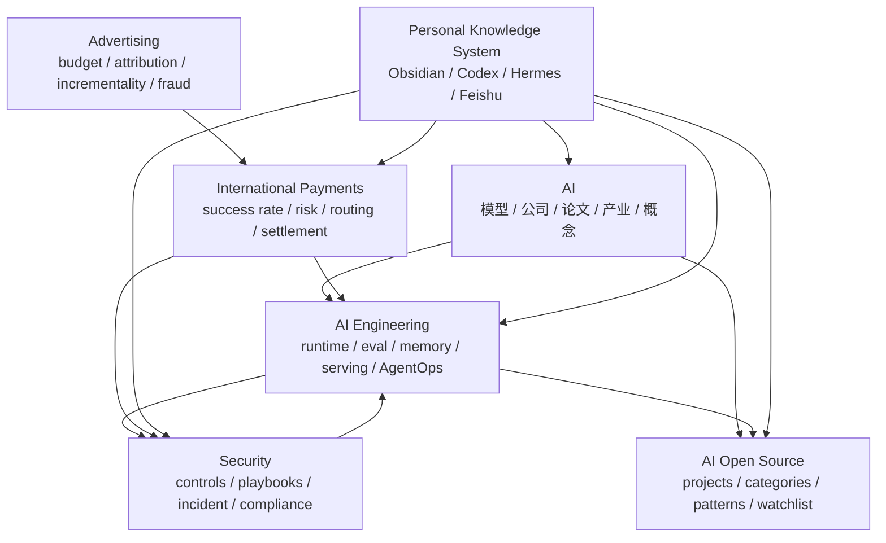

# 核心知识网络

这页回答一个更接近人脑的问题：

```text
这些领域之间到底怎么互相长出来？
```

## 一句话结构

AI 是总入口；AI Engineering 是把 AI 做成系统；AI Open Source 是寻找可采用项目和工程样本；Security 是边界和控制；International Payments 是业务实战域；Advertising 是另一个成熟业务域；Personal Knowledge System 是把这些知识和 agent 协作起来的方法层。

## 领域关系图



## 先按问题走

| 如果你正在问... | 先读 | 然后转到 |
|---|---|---|
| 我想理解 AI 世界怎么分层 | [[10-Knowledge/AI/学习路径]] | [[10-Knowledge/AI-Engineering/学习路径]] 或 [[10-Knowledge/AI-Open-Source/学习路径]] |
| 我想把 Agent 系统做出来 | [[10-Knowledge/AI-Engineering/学习路径]] | [[10-Knowledge/AI-Open-Source/学习路径]] / [[10-Knowledge/Security/学习路径]] |
| 我想跟踪开源项目 | [[10-Knowledge/AI-Open-Source/学习路径]] | [[10-Knowledge/AI-Engineering/04-Evaluation/评测索引]] |
| 我担心 Agent 污染知识库或乱用工具 | [[10-Knowledge/Security/学习路径]] | [[10-Knowledge/AI-Engineering/05-Deployment/部署索引]] / [[20-Maps/跨工具协作地图]] |
| 我想补业务实战能力 | [[10-Knowledge/International-Payments/学习路径]] | [[10-Knowledge/Security/学习路径]] / [[10-Knowledge/Advertising/专题总览]] |
| 我想让 Hermes / Codex 帮我维护知识 | [[10-Knowledge/Personal-Knowledge-System/专题总览]] | [[90-Agent-System/workflows/knowledge-intake-and-promotion]] |

## 推荐学习顺序

第一次系统试读，建议按这个顺序：

1. [[10-Knowledge/AI/学习路径]]
2. [[10-Knowledge/AI-Engineering/学习路径]]
3. [[10-Knowledge/AI-Open-Source/学习路径]]
4. [[10-Knowledge/Security/学习路径]]
5. [[10-Knowledge/International-Payments/学习路径]]

如果你已经带着业务问题来，直接从 International Payments 或 Advertising 开始，再反向补 Security 和 AI Engineering。

## 知识网络维护规则

1. 新内容先判断主领域，再补跨领域链接。
2. 一个 project 不只放在 AI Open Source，还要连接到它体现的 engineering pattern。
3. 一个安全控制不只放在 Security，还要连接到它约束的系统或业务场景。
4. 一个业务问题如果需要 AI 自动化，才连接到 AI Engineering。
5. 不确定的新领域先走 working vault proposal，不直接创建正式目录。
