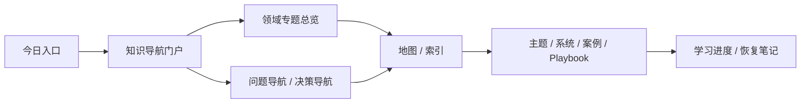

# 知识导航门户

这页是 Tony AI Wiki 的知识阅读入口。它不回答“文件放在哪里”，只回答：

```text
我现在想理解一个问题，应该从哪张图、哪个领域、哪条路径进入？
```

## 先选你的模式

| 我现在想... | 入口 | 什么时候用 |
|---|---|---|
| 快速恢复今天的方向 | [[00-Home/今日入口]] | 刚打开 Obsidian |
| 像信息流一样读知识库 | [[00-Home/阅读控制台]] | 想先看推荐、最近更新、主题检索和沉淀动作 |
| 看当前 AI First 系统主线 | [[00-Home/当前主线]] | 想知道系统建设到哪 |
| 看核心知识怎么互相连接 | [[20-Maps/核心知识网络]] | 想建立知识网络，而不是只读单个目录 |
| 看哪些内容该更新 | [[20-Maps/内容更新雷达]] | 觉得知识库内容陈旧，想规划刷新 |
| 学一个知识领域 | [[#按领域进入]] | 想系统学习 |
| 把所有领域摊开看 | [[20-Maps/领域平铺图谱]] | 想看当前库和旧库的领域全貌 |
| 按问题找旧库里的好地图 | [[20-Maps/旧库可读入口索引]] | 旧库内容已导入但入口不好找 |
| 用画布扫全局关系 | [[20-Maps/知识导航门户.canvas|知识导航门户 Canvas]] | 想用视觉方式看入口关系 |
| 看专家问题感 | [[20-Maps/已有知识图谱专家问题地图]] | 想知道高手会问什么 |
| 看迁移关系 | [[20-Maps/旧库迁移地图]] | 只有在整理/迁移旧库时用 |

## 按领域进入

| 领域 | 当前正式入口 | 旧库可读入口 | 最适合的问题 |
|---|---|---|---|
| AI 总览 | [[10-Knowledge/AI/专题总览]] / [[10-Knowledge/AI/学习路径]] | [[10-Knowledge/AI/00-Navigation/AI 总控制塔]] | AI 世界怎么分层？我应该看模型、系统、论文、组织还是案例？ |
| AI 问题导航 | [[10-Knowledge/AI/专题总览]] | [[10-Knowledge/AI/00-Navigation/AI 问题导航]] | 我想搭 Agent、做 LLMOps、做 AI Security、理解 memory/self-improvement |
| AI 决策导航 | [[10-Knowledge/AI-Engineering/专题总览]] | [[10-Knowledge/AI/00-Navigation/AI 决策导航]] | workflow vs agent、LangGraph vs AutoGen、Langfuse vs Phoenix |
| AI Engineering | [[10-Knowledge/AI-Engineering/专题总览]] / [[10-Knowledge/AI-Engineering/学习路径]] | [[10-Knowledge/AI-Engineering/专题总览 - 旧库]] | AI 系统如何被评估、上线、观测、治理 |
| AI Open Source | [[10-Knowledge/AI-Open-Source/专题总览]] / [[10-Knowledge/AI-Open-Source/学习路径]] | [[10-Knowledge/AI-Open-Source/专题总览 - 旧库]] | 哪些开源项目值得长期跟，怎么判断可采用性 |
| Advertising | [[10-Knowledge/Advertising/专题总览]] | [[10-Knowledge/Advertising/广告投放问题导航]] | 预算、归因、SKAN、增量、fraud、投放复盘 |
| International Payments | [[10-Knowledge/International-Payments/专题总览]] / [[10-Knowledge/International-Payments/学习路径]] | [[10-Knowledge/International-Payments/国际支付问题导航]] | 支付成功率、3DS、拒付、路由、对账 |
| Security | [[10-Knowledge/Security/专题总览]] / [[10-Knowledge/Security/学习路径]] | [[10-Knowledge/Security/安全问题导航]] | 风险、权限、控制点、incident response |
| Personal Knowledge System | [[10-Knowledge/Personal-Knowledge-System/专题总览]] | [[20-Maps/跨工具协作地图]] | Obsidian、GitHub、飞书、Codex、Hermes 怎么分工 |

## 按问题进入

| 如果你问的是... | 先看 |
|---|---|
| 我应该从哪里开始理解 AI？ | [[10-Knowledge/AI/学习路径]] |
| 我想搭一个 Agent 系统 | [[10-Knowledge/AI-Engineering/学习路径]] |
| 我想做 LLMOps / AgentOps | [[10-Knowledge/AI-Engineering/学习路径]] |
| 我想做 AI Security | [[10-Knowledge/Security/学习路径]] |
| 我想理解 AI 记忆与自改进 | [[10-Knowledge/AI-Engineering/学习路径]] |
| 我想选 AI 开源栈 | [[10-Knowledge/AI-Open-Source/学习路径]] |
| 我想把 Mac 变成 AI 实验室 | [[10-Knowledge/AI-Engineering/学习路径]] |
| 我想通过人物、组织与案例理解 AI | [[10-Knowledge/AI/学习路径]] |
| 我想通过作者、论文与时间线理解 AI | [[10-Knowledge/AI/学习路径]] |
| 我想知道一个领域高手会怎么问 | [[20-Maps/已有知识图谱专家问题地图]] |

## 读图顺序



## 入口分工

| 页面 | 用途 | 不适合做什么 |
|---|---|---|
| [[00-Home/今日入口]] | 每天打开 Obsidian 的第一屏 | 不承载完整知识图谱 |
| [[00-Home/阅读控制台]] | 仿 `fangbm` 的阅读工作台，适合消费最近更新和推荐入口 | 不替代正式知识资产 |
| [[20-Maps/知识导航门户]] | 人类阅读和学习入口 | 不记录迁移细节 |
| [[20-Maps/核心知识网络]] | 解释核心领域之间如何互相连接 | 不替代各领域学习路径 |
| [[20-Maps/知识导航门户.canvas|知识导航门户 Canvas]] | 可视化入口关系 | 不替代正文地图 |
| [[20-Maps/旧库可读入口索引]] | 把旧库里真正好用的入口重新挂出来 | 不做迁移计划 |
| [[20-Maps/旧库迁移地图]] | 维护旧库迁移关系 | 不作为日常阅读入口 |
| [[90-Agent-System/仓库地图]] | 给 Codex / Hermes 读仓库结构 | 不作为人类学习入口 |

## 当前最值得修的地图

| Priority | Map | Why |
|---|---|---|
| P1 | [[10-Knowledge/AI/学习路径]] | 已有正式试读骨架，下一步是提升模型谱系和 AI 五条主干 |
| P1 | [[10-Knowledge/AI-Engineering/学习路径]] | 已有正式试读骨架，下一步是按 Track A/B 提升正文 |
| P2 | [[10-Knowledge/International-Payments/学习路径]] | 已有正式试读骨架，下一步是提升成功率和拒付治理正文 |
| P2 | [[10-Knowledge/Security/学习路径]] | 已有正式试读骨架，下一步是提升 AI 产品安全控制和 playbook |
| P3 | [[10-Knowledge/AI-Open-Source/专题总览]] | 已有项目体系，下一步是跑通 Unsloth 项目卡 |
