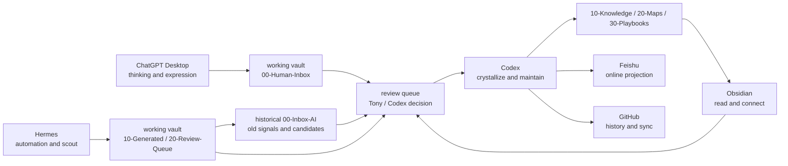

# 跨工具协作地图

这张图说明 Obsidian、GitHub、Codex、ChatGPT Desktop、Hermes、Feishu 在同一知识系统里的分工。

当前系统正在从单库目录边界升级为多库边界，决策见 [[90-Agent-System/decisions/2026-06-16-vault-boundary-split]]。

## Tool Roles

| Tool | Primary Role | Default Writes |
|---|---|---|
| Obsidian | 阅读、链接、人工编辑、复盘 | Tony 手动维护的 Markdown |
| GitHub | 版本、历史、同步、回滚 | Git commits and reviews |
| Codex | 本地维护、批量重构、提升知识、验证结构 | 当前仓库内受控目录 |
| ChatGPT Desktop | 思考、表达、对话、来源理解 | 默认不直接写 canonical 知识 |
| Hermes | 自动化、scout、recall、digest、候选生成 | `/Users/tony/Vault/tony-wiki-space/tony-ai-working-vault/` |
| output-feishu | 飞书发布中间层 | 清洗、过滤后的 Markdown / assets |
| Feishu | 任意地方访问、移动端阅读、分享协作 | 飞书知识库 / 云文档 projection |

## Capability Layer

个人 Agent 名称作为能力别名使用，不另起一套组织架构：

- [[60-Agents/Personal-Agent-Capabilities]]
- [[90-Agent-System/workflows/project-companion]]

## Collaboration Loop



## Access Layer

```text
Obsidian = 个人知识生产中心
GitHub private repo = 长期版本事实源
output-feishu = 可发布中间层
飞书知识库 = 任意地方访问 / 移动端阅读 / 分享协作
飞书 CLI = 自动同步执行器
```

## Boundaries

- Obsidian is the personal knowledge production center.
- GitHub private repo preserves long-term versioned facts.
- `output-feishu/` is publishable intermediate output, not canonical knowledge.
- Codex can restructure, but should follow [[AGENTS]] and nearest workflows.
- ChatGPT can think and draft, but important decisions must land in Markdown.
- Hermes can scout and recall inside the working vault, but canonical memory and knowledge require review.
- Feishu is an online projection surface, not the canonical source of truth.
- Long-running AI working material belongs in `tony-ai-working-vault`; the main vault should keep reviewed knowledge and boundary maps.

## Related

- [[60-Agents/README]]
- [[90-Agent-System/仓库地图]]
- [[90-Agent-System/decisions/2026-06-16-vault-boundary-split]]
- [[00-Inbox-AI/MEMORY-PROTOCOL]]
- [[90-Agent-System/workflows/knowledge-evolution]]
- [[90-Agent-System/workflows/hermes-codex-learning-chain]]
- [[90-Agent-System/workflows/project-companion]]
- [[90-Agent-System/workflows/feishu-publishing]]
- [[90-Agent-System/integrations/Hermes-Codex]]
- [[90-Agent-System/integrations/Feishu]]
