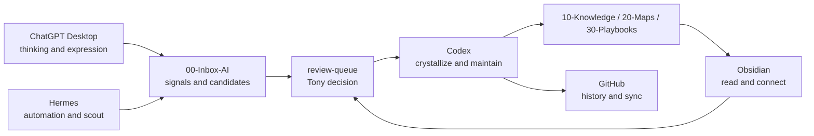

# 跨工具协作地图

这张图说明 Obsidian、GitHub、Codex、ChatGPT Desktop、Hermes 在同一知识系统里的分工。

## Tool Roles

| Tool | Primary Role | Default Writes |
|---|---|---|
| Obsidian | 阅读、链接、人工编辑、复盘 | Tony 手动维护的 Markdown |
| GitHub | 版本、历史、同步、回滚 | Git commits and reviews |
| Codex | 本地维护、批量重构、提升知识、验证结构 | 当前仓库内受控目录 |
| ChatGPT Desktop | 思考、表达、对话、来源理解 | 默认不直接写 canonical 知识 |
| Hermes | 自动化、scout、recall、digest、候选生成 | `00-Inbox-AI/` staging 和 projections |

## Collaboration Loop

## Boundaries

- Obsidian is the human reading surface, not the only memory system.
- GitHub preserves evolution, but does not decide what is canonical.
- Codex can restructure, but should follow [[AGENTS]] and nearest workflows.
- ChatGPT can think and draft, but important decisions must land in Markdown.
- Hermes can scout and recall, but canonical memory and knowledge require review.

## Related

- [[60-Agents/README]]
- [[90-Agent-System/仓库地图]]
- [[00-Inbox-AI/MEMORY-PROTOCOL]]
- [[90-Agent-System/workflows/knowledge-evolution]]
