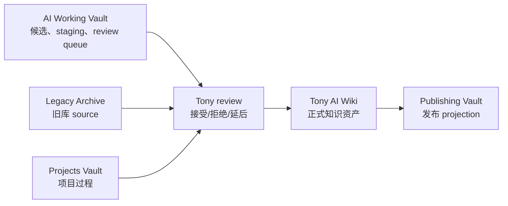

# 按边界拆分多库

## Decision

Tony AI Wiki 不再默认按“一个 Obsidian 库承载所有东西”继续扩张，而是按使用边界拆成多个库。

核心原则：

> 主库只承载已经变成资产的知识；生产过程、项目推进、旧库归档和发布投影分别进入独立边界。

## Why

当前单库已经同时承担这些职责：

- 正式知识资产
- AI 生成内容和待确认材料
- Hermes / Codex 自动化 staging、日志和任务队列
- 旧 `tony2026` 导入材料
- 项目推进记录
- 飞书和公开发布中间层

这些内容放在一个仓库里，目录层级可以暂时隔离，但长期会带来几个问题：

- 正式知识和生产过程混在一起，阅读入口变重。
- AI 自动化需要较大的写入空间，容易污染主库心智模型。
- 旧库材料是 source archive，不应该长期留在主库核心路径里。
- 项目过程和长期知识的生命周期不同，更新节奏不同。
- 发布 projection 不是 canonical knowledge，不应该和主库事实源混在一起。

## Target Vaults

| Vault | Boundary | Canonical Content | Default Write Rule |
|---|---|---|---|
| `tony-ai-wiki-2026` | 主知识库 | 已审阅、可复用、稳定的知识资产、地图、playbooks、agent 规则 | 只接收 review 后的 crystallized notes |
| `tony-ai-working-vault` | AI 工作库 | Hermes / Codex staging、候选稿、请求队列、自动化日志、review queue | AI 可高频写入，但默认不等于正式知识 |
| `tony-projects-vault` | 项目库 | 项目计划、执行记录、项目状态、阶段复盘 | 项目内自带状态和下一步 |
| `tony-legacy-archive` | 旧库归档 | 原 `tony2026` 导入内容和迁移索引 | 默认只读；promotion 通过主库生成新笔记 |
| `tony-publishing-vault` | 发布库 | 飞书、CSDN、openEuler、公众号、视频脚本等发布稿和 projection | 面向发布，不作为知识事实源 |

## First-Phase Split

第一阶段只做最低风险拆分：

1. 新建 `tony-ai-working-vault`，承接 `00-Inbox-AI/`、Hermes / Codex staging、自动化日志和候选稿。
2. 新建 `tony-legacy-archive`，承接旧库源副本和旧库只读入口。
3. 主库暂时保留 `40-Projects/` 和 `output-feishu/`，等工作库与归档库稳定后再拆。
4. 主库保留跨库地图、promote workflow、agent rules 和正式知识入口。

## Implementation Log

### 2026-06-16

已建立父级空间：

```text
/Users/tony/Vault/tony-wiki-space/
```

已复制当前主库到：

```text
/Users/tony/Vault/tony-wiki-space/tony-ai-wiki-2026/
```

已建立 Hermes / Codex 工作库：

```text
/Users/tony/Vault/tony-wiki-space/tony-ai-working-vault/
```

工作库已写入 Hermes 边界记忆：

- `AGENTS.md`
- `30-Memory/Hermes-Boundary-Contract.md`
- `30-Memory/Hermes-Working-Memory.md`
- `90-System/workflows/hermes-to-main-vault-promotion.md`

已建立旧库归档占位：

```text
/Users/tony/Vault/tony-wiki-space/tony-legacy-archive/
```

已切换并重启 Hermes：

- `~/.hermes/cron/jobs.json` 的 job `workdir` 已改为 `tony-ai-working-vault`。
- Hermes cron prompt 中的旧 `00-Inbox-AI/` 写入路径已改到 working vault 目录。
- `daily-git-push` 已停用，避免 Hermes 自动提交或推送主知识库。
- `~/.hermes/scripts/` 下的 scout / memory scripts 默认写入 working vault。
- `~/.hermes/SOUL.md` 已更新为多库边界记忆。
- `ai.hermes.gateway` 已通过 launchd 重启。
- `ai.hermes.webui` 已新增 LaunchAgent，并监听 `http://127.0.0.1:8648/`。

已删除不再需要的 Hermes cron 任务：

- `daily-git-push`
- `hermes-core-radar-morning`
- `hermes-core-radar-afternoon`

当前 Hermes cron 任务表只保留 active working-vault jobs。

## Promotion Rule

跨库流转必须显式发生：



默认规则：

- AI 工作库内容不自动成为主库内容。
- 旧库内容不在原地改写；需要时在主库生成 reviewed note，并链接回 source。
- 项目库中的复盘、方法、决策，只有稳定后才进入主库。
- 发布库可以改写表达，但不能反向覆盖主库事实。

## Main Vault After Split

主库应逐步收敛为：

| Path | Future Meaning |
|---|---|
| `00-Home/` | 人类入口、当前主线、跨库导航 |
| `10-Knowledge/` | 正式知识资产 |
| `20-Maps/` | 主库和跨库导航地图 |
| `30-Playbooks/` | 稳定方法和可复用流程 |
| `60-Agents/` | Agent 角色和能力边界 |
| `90-Agent-System/` | Agent rules、workflows、decisions、automation specs |

逐步迁出：

| Current Path | Target Vault |
|---|---|
| `00-Inbox-AI/` | `tony-ai-working-vault` |
| old imported source copy | `tony-legacy-archive` |
| `40-Projects/` | `tony-projects-vault` |
| `output-feishu/`, `output-public/` | `tony-publishing-vault` |

## Open Questions

- 多库之间的链接格式是否使用 Obsidian URI、相对 source path，还是统一用 GitHub URL。
- Hermes / Codex 自动化是否先改写到 working vault，再由主库 automation 拉取 accepted package。
- 旧库迁出后，主库是否保留轻量 readable entrance mirror。
- Publishing vault 是否需要同时管理飞书文档 token 和本地 Markdown projection。

## Next Actions

1. 建立 `tony-ai-working-vault` 的最小目录和 AGENTS.md。
2. 建立 `tony-legacy-archive` 的只读迁移说明。
3. 把 Hermes / Codex 自动化目标从主库 `00-Inbox-AI/` 改到 working vault。
4. 在主库保留跨库索引和 promote workflow。
5. 小批量迁移 `00-Inbox-AI/` 中低风险目录，验证链接和自动化。
